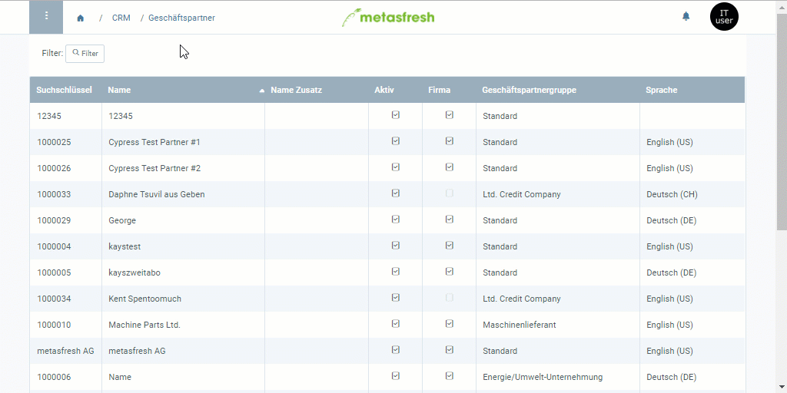

## Übersicht
Bevor ein Kreditlimit wirksam werden kann, muss es von einem autorisierten Nutzer freigegeben werden.

## Schritte
1. [Stelle ein Kreditlimit für einen Geschäftspartner ein](Kreditlimit_einstellen).
1. Gehe zur Registerkarte "Kreditlimit" unten auf der Seite und [selektiere](AuswahlBelege) die Zeile des Kreditlimits, für das Du die Freigabe anfordern möchtest.
1. [Starte die Aktion](AktionStarten) "Kreditlimit Freigabe anfordern". Es öffnet sich ein Overlay-Fenster.
1. Wähle im Feld **Approved By** den autorisierten Nutzer aus, der die Freigabe genehmigen soll.
1. Klicke auf "Start", um die Freigabe anzufordern und das Overlay-Fenster zu schließen.
 >**Hinweis:** Der autorisierte Nutzer erhält oben rechts nun eine [Benachrichtigung](Benachrichtigungsarten) , in der er gebeten wird, das Kreditlimit freizugeben.

## Nächste Schritte
- [Kreditlimit freigeben (nur autorisierte Nutzer)](Kreditlimit_Freigabe).

## Beispiel

