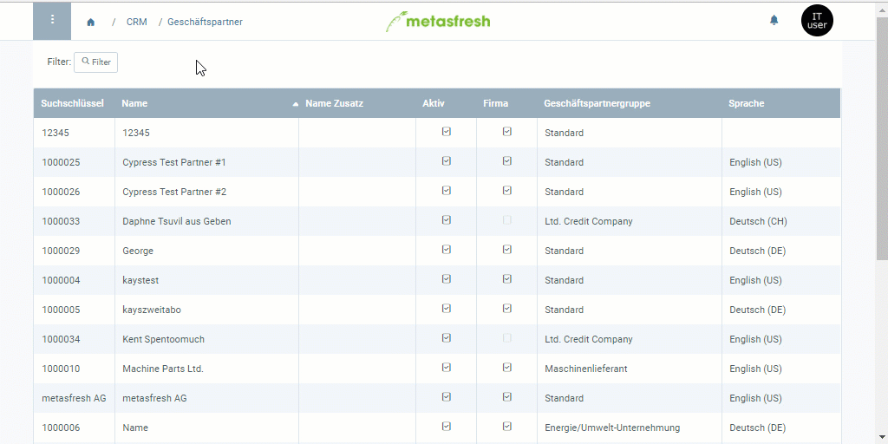

## Übersicht
Mit dem Kreditlimit kannst Du in metasfresh festlegen, bis zu welchem Höchstbetrag Deine Geschäftspartner offene Rechnungen sammeln können. Wurde dieser Betrag von einem Partner erreicht, können so lange keine neuen von ihm erteilten Aufträge bearbeitet werden, wie er seine Schulden nicht beglichen hat.

## Schritte
1. Öffne den Eintrag eines bestehenden [Geschäftspartners](Menu) bzw. [lege einen neuen an](Neuer_Geschaeftspartner).
1. Gehe zur Registerkarte "Kreditlimit" unten auf der Seite und klicke auf . Es öffnet sich ein neues Fenster.
1. Wähle eine **Kreditlimit Art** aus, z.B. *Management*.
1. Gib einen **Betrag** ein, der maximal mit offenen Rechnungen des Geschäftspartners erreicht werden darf, bis er für weitere Aufträge gesperrt wird.
1. Stelle ein **Datum von** ein.
 >**Hinweis:** Liegt das Datum in der *Vergangenheit*, gilt das Kreditlimit *ab sofort*. Liegt es in der *Zukunft*, gilt es *erst ab diesem Datum*.

1. Klicke auf "Bestätigen", um das Fenster zu schließen und das Kreditlimit zur Liste hinzuzufügen.
 >**Hinweis:** Das Kreditlimit wird erst nach [Freigabe durch einen autorisierten Nutzer](Kreditlimit_Freigabe) wirksam.

## Nächste Schritte
1. [Freigabe des Kreditlimits anfordern](Kreditlimit_Freigabe_anfordern).
1. [Kreditlimit freigeben (nur autorisierte Nutzer)](Kreditlimit_Freigabe).

## Beispiel

