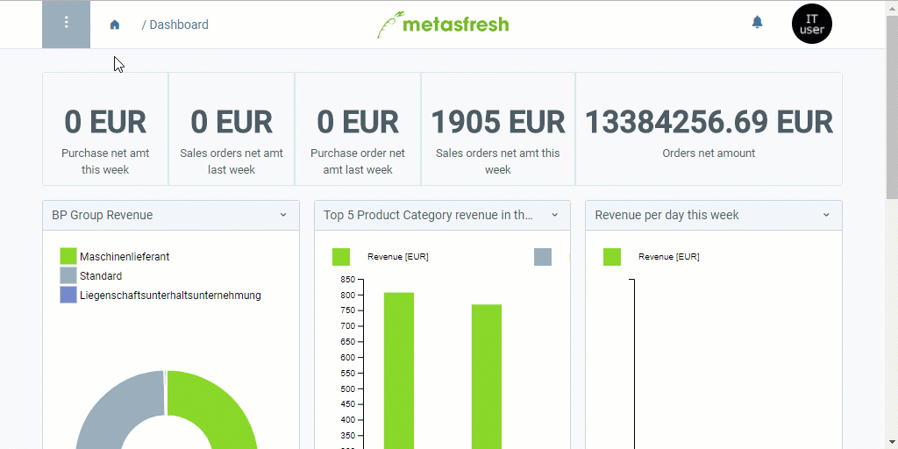

## Übersicht
Mittels der Kreditlimitarten hast Du die Möglichkeit, die Kreditlimits, die Du Deinen Geschäftspartnern setzt, zu benennen und zu organisieren und somit kenntlich zu machen, wofür die Limits bestimmt sind oder von wem bzw. welcher Abteilung sie festgelegt wurden.

Beispielsweise verwendest Du eine Limitart namens "Versicherung", um zu kennzeichnen, dass dieses Limit aus versicherungstechnischen Gründen eingestellt wurde. Der Geschäftsführer möchte den Limitbetrag jedoch erhöhen, also wählt er die Limitart "Management", um ein neues Kreditlimit festzulegen.   metasfresh entscheidet dabei anhand des Anfangsdatums des Kreditlimits, ob es wirksam ist oder nicht. So kann man auch abgelaufene Limits außer Kraft setzen und mit neuen überschreiben.

Darüber hinaus kannst Du ebenfalls in der Kreditlimitart einstellen, dass das Kreditlimit automatisch freigegeben wird und somit keine Bestätigung eines autorisierten Nutzers benötigt.

## Schritte
1. [Gehe ins Menü](Menu) und öffne das Fenster "Credit Limit Type".
1. [Lege eine neue Kreditlimitart an](Neuer_Datensatz_Fenster_Webui).
1. Benenne die Kreditlimitart im Feld **Name**.
1. Lege eine **Reihenfolge** fest, in der die Kreditlimitart bei [Einstellung des Kreditlimits](Kreditlimit_einstellen) in der Dropdown-Liste aufgelistet werden soll.
1. ***Optional:*** Setze ein Häkchen bei **Auto Approval**, wenn das Kreditlimit ohne Bestätigung eines autorisierten Nutzers freigegeben werden soll.
 >**Hinweis:** In diesem Fall bleibt das Feld **Freigegeben von** in der Kreditlimitzeile nach der Freigabe leer.

1. [metasfresh speichert automatisch](Speicheranzeige).

## Beispiel

