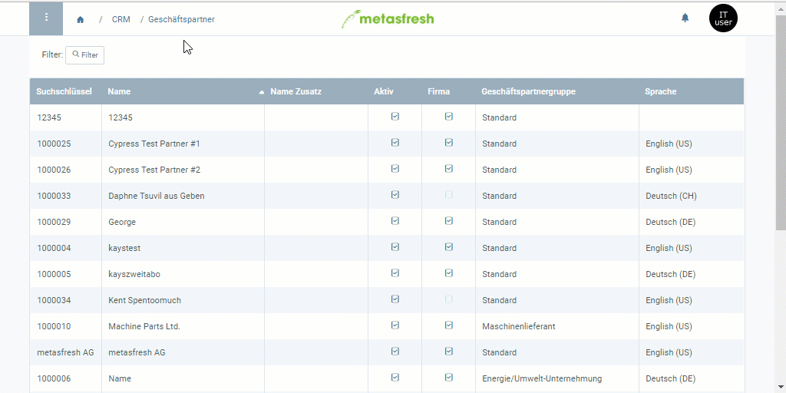

## Übersicht
Hier wird beschrieben, wie Du den [Kreditstatus](Kreditstatusarten) eines einzelnen Geschäftspartners verwalten kannst. Wenn Du wissen möchtest, wie Du den Kreditstatus für eine gesamte Geschäftspartnergruppe einstellst, klicke [hier](Kreditstatus_einstellen_GPGruppe).

## Schritte
1. Öffne den Eintrag eines bestehenden [Geschäftspartners](Menu) bzw. [lege einen neuen an](Neuer_Geschaeftspartner).
1. Gehe zur Registerkarte "Statistik" unten auf der Seite.
1. Klicke doppelt auf das Feld **Kreditstatus** der Statistikzeile und wähle aus der Dropdown-Liste einen Status aus, z.B. *Kredit OK*.
1. [metasfresh speichert automatisch](Speicheranzeige).

## Nächste Schritte
1. [Kreditlimit einstellen](Kreditlimit_einstellen).
1. [Freigabe des Kreditlimits anfordern](Kreditlimit_Freigabe_anfordern).
1. [Kreditlimit freigeben (nur autorisierte Nutzer)](Kreditlimit_Freigabe).

## Beispiel

