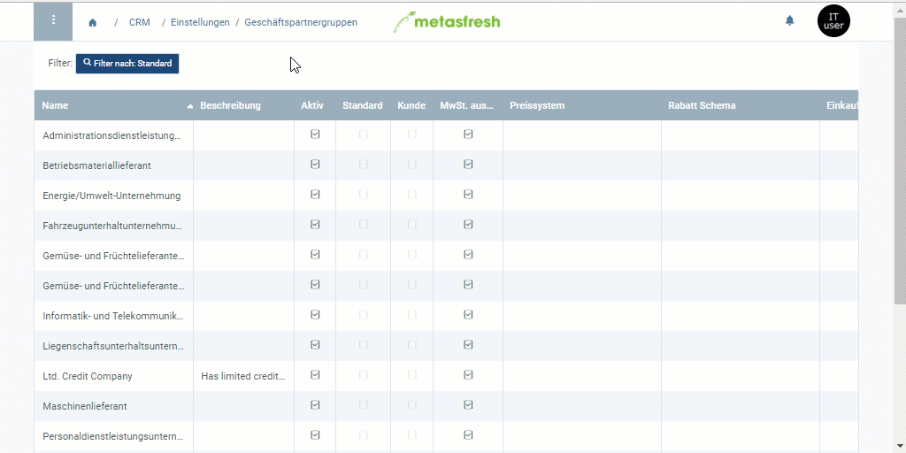

## Übersicht
Wenn Du einen [Kreditstatus](Kreditstatusarten) für eine gesamte Geschäftspartnergruppe einstellst, gilt dieser für jeden Geschäftspartner, der bei [Neuerstellung](Neuer_Geschaeftspartner) mit dieser Gruppe verknüpft wird.

Möchtest Du wissen, wie Du den Kreditstatus eines Geschäftspartners daraufhin individuell verwalten kannst, klicke [hier](Kreditstatus_einstellen_GP).

## Schritte

### Kreditstatus einstellen
1. Öffne den Eintrag einer bestehenden [Geschäftspartnergruppe](Menu) bzw. [lege eine neue an](Neue_Geschaeftspartnergruppe).
1. Gehe zum Feld **Kreditstatus** und wähle einen Status aus, z.B. *Kredit OK*.
 >**Hinweis:** Dieser Kreditstatus wird nur in den Geschäftspartnereinträgen übernommen, die nach Abschluss dieser Einstellung mit dieser Geschäftspartnergruppe verknüpft werden. Die Kreditstatus aller bestehenden mit dieser Geschäftspartnergruppe verknüpften Partner bleiben unverändert.

1. [metasfresh speichert automatisch](Speicheranzeige).

### Mit Geschäftspartner verknüpfen
1. Öffne den Eintrag eines bestehenden [Geschäftspartners](Menu) bzw. [lege einen neuen an](Neuer_Geschaeftspartner).
1. Gehe zum Feld **Geschäftspartnergruppe** und wähle die zuvor mit dem Kreditstatus konfigurierte Gruppe aus.
1. Gehe zur Registerkarte "Statistik" unten auf der Seite. Dort kannst Du den Kreditstatus in der gleichnamigen Spalte einsehen und [individuell verwalten](Kreditstatus_einstellen_GP).

## Nächste Schritte
1. [Kreditlimit einstellen](Kreditlimit_einstellen).
1. [Freigabe des Kreditlimits anfordern](Kreditlimit_Freigabe_anfordern).
1. [Kreditlimit freigeben (nur autorisierte Nutzer)](Kreditlimit_Freigabe).

## Beispiel

