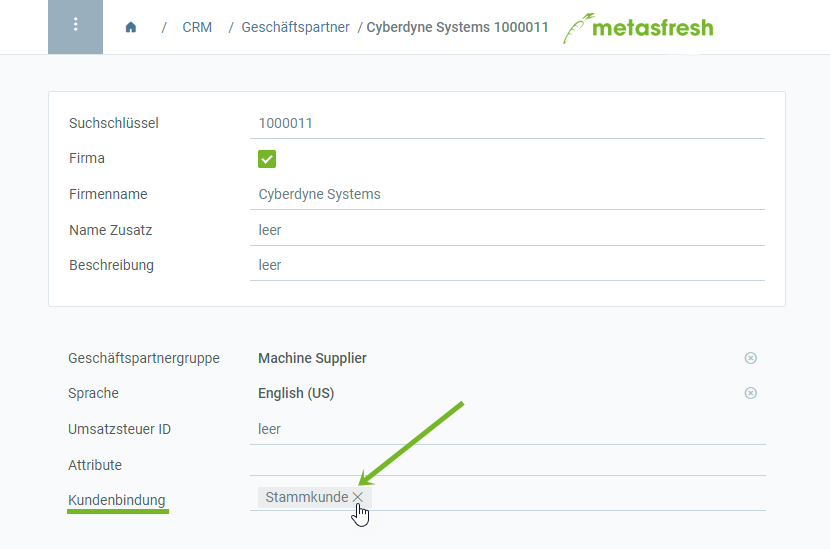

## Überblick
Legst Du in metasfresh einen Kunden neu an, hat er zunächst keinen besonderen Kundenstatus. Sobald Du jedoch einen Vertrag für diesen Kunden erfasst, wird er als *Neukunde* markiert. Ab dem Zeitpunkt der zweiten Rechnungsstellung erhält er dann den Status *Stammkunde*, welchen er bis zu 12 Monate nach Ablauf des Vertrages behält. Wird innerhalb dieses Zeitraums für diesen Kunden kein neuer Vertrag erfasst oder der alte verlängert, verliert er den Stammkundenstatus wieder.

Die Kundenstatus werden täglich automatisch aktualisiert. Eine manuelle Aktualisierung ist über den Menüpunkt "[Create Missing Customer Retention](Menu)" möglich.

## Schritte

### Vertrag erfassen und Rechnungen erstellen
1. [Lege einen neuen Kunden an](Neuer_Geschaeftspartner_Kunde), sofern noch nicht geschehen.
1. [Erfasse einen Vertrag für diesen Kunden](Abonnementvertrag_erfassen). Der Kunde erhält nun den Status "Neukunde".
1. [Erstelle eine Rechnung](Zu_Auftrag_Rechnung_erstellen) zu diesem Vertrag (1. Rechnung).
1. [Verlängere den Vertrag](Vertrag_verlaengern).
1. [Erstelle eine Rechnung](Zu_Auftrag_Rechnung_erstellen) zu dem verlängerten Vertrag (2. Rechnung). Der Kunde erhält nun den Status "Stammkunde".

### Kundenbindungsstatus einsehen
1. Öffne den Eintrag eines Kunden in der [Einzelansicht](Ansichten#einzelansicht) unter dem Menüpunkt "[Geschäftspartner](Menu)".
1. Suche das Feld **Kundenbindung** auf.

