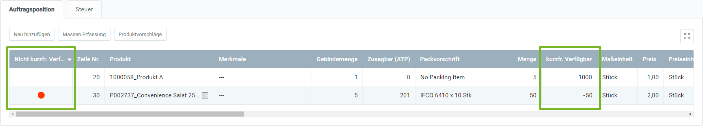

## Überblick
Bei der [Erfassung von Auftragspositionen](Auftrag_erfassen) behält metasfresh nicht nur den zusicherbaren Bestand im Auge (engl.: *available-to-promise* = ATP), welcher sich aus dem aktuell verfügbaren Bestand sowie zukünftigen [Warenein-](Zu_Bestellung_Wareneingang_erstellen) und [-ausgängen](Zu_Auftrag_Lieferschein_erstellen) zusammensetzt (siehe [Materialdisposition](Menu)), sondern auch den _kurzfristig verfügbaren Bestand_, welcher alle bisher erfassten Auftragspositionen aus fertiggestellten und nicht fertiggestellten Aufträgen innerhalb einer festgelegten Zeitspanne mitberücksichtigt. Diese Eigenschaft ist von besonderer Bedeutung, wenn mehrere Aufträge für verschiedene Kunden mit demselben Produkt zur gleichen Zeit bzw. in kurzen Zeitabständen erfasst werden, wodurch es zu eventuellen Komplikationen bei der Bereitstellung von Waren kommen könnte – würde metasfresh dies nicht überprüfen.

Die kurzfristige Verfügbarkeit eines Produktes kannst Du während der Auftragserfassung in den jeweiligen Auftragszeilen einsehen. Ist ein Produkt ***nicht*** kurzfristig verfügbar, wird Dir in der Spalte **Nicht kurzfr. verfügbar** ein **roter** Punkt angezeigt, anderenfalls bleibt die Spalte leer. Die kurzfristig verfügbare Menge eines Produktes auf Lager siehst Du in der Spalte **kurzfr. verfügbar**.

Wird ein Auftrag mit Produkten, die als kurzfristig nicht verfügbar erkannt wurden, fertiggestellt und wurden entsprechende Produktplandaten hinterlegt, dann werden anschließend je nach [Konfiguration der Plandaten](Produktplandaten) automatisch Bestellungen oder Produktionsaufträge erstellt, um die Bestände der aufgebrauchten Produkte wieder aufzufüllen.

## Für den Systemadministrator
Als Systemadministrator kannst Du unter dem Menüpunkt "Einstellungen zur verfügbaren Menge für den Verkauf" die Parameter konfigurieren, mit denen metasfresh die kurzfristige Verfügbarkeit überprüft, sowie unterschiedliche Einstellungen für verschiedene Organisationseinheiten treffen. Es können u.a. die folgenden Parameter gesetzt werden:

| Parameter / Feld | Beschreibung |
| :--- | :--- |
| Rückschauintervall zu Auftragspositionen in Bearbeitung | Intervall in Stunden bis zum aktuellen Zeitpunkt, innerhalb dessen andere noch nicht fertiggestellte Auftragspositionen berücksichtigt werden sollen. Sollte abhängig von der üblichen Auftragsbearbeitungsdauer gesetzt werden. |
| Vorausschauintervall zu geplanten Lieferungen | Intervall in Stunden ab Bereitstellungsdatum des aktuellen Auftrags, innerhalb dessen geplante Lieferungen berücksichtigt werden sollen. Sollte abhängig vom üblichen Zulieferungsintervall gesetzt werden. |
| Farbe für kurzfristiges Verfügbarkeitsproblem | Farbe, mit der Auftragszeilen markiert werden, wenn der derzeitige Lagerbestand abzgl. absehbarer Lieferungen nicht ausreicht, um die jeweilige Auftragsposition zu bedienen. |
| Asynchrone Abfrage | Entscheidet, ob die Verfügbarkeitsabfrage im Hintergrund erfolgt. Die betreffenden Auftragspositionen werden aktualisiert, sobald das Ergebnis vorliegt. |
| Maximale Wartezeit auf asynchrone Antwort | Maximale Zeit in Millisekunden, die bei einer asynchronen Abfrage gewartet wird, bevor sie mit einer Fehlermeldung abgebrochen wird. |
| Sektion | Organisatorische Einheit des Mandanten |

Um die kurzfristige Verfügbarkeitsprüfung zu konfigurieren, gehe wie folgt vor:

## Schritte
1. [Gehe ins Menü](Menu) und öffne das Fenster "Einstellungen zur verfügbaren Menge für den Verkauf".
1. Öffne einen bestehenden Eintrag oder [lege einen neuen an](Neuer_Datensatz_Fenster_Webui).
1. Trage den **Rückschauintervall zu Auftragspositionen in Bearbeitung (Std)** ein.
1. Trage den **Vorausschauintervall zu geplanten Lieferungen (Std)** ein.
1. Wähle eine **Farbe für kurzfristiges Verfügbarkeitsproblem** aus.
1. ***Optional:*** Erfasse eine **Beschreibung** in dem dafür vorgesehenen Textfeld.
1. 1) Setze ein Häkchen bei **Asynchrone Abfrage**, wenn Du möchtest, dass die Verfügbarkeitsabfrage im Hintergrund erfolgen soll. Es erscheint ein neues Feld **Maximale Wartezeit auf asynchrone Antwort (ms)**.   2) Gib eine **Maximale Wartezeit auf asynchrone Antwort (ms)** ein.

1. Wähle die **Sektion** aus, für die diese Einstellungen gelten sollen.
1. [metasfresh speichert automatisch](Speicheranzeige).

## Nächste Schritte
- [Konfiguriere Plandaten für die automatische Bestandsauffüllung aufgebrauchter Produkte](Produktplandaten).
