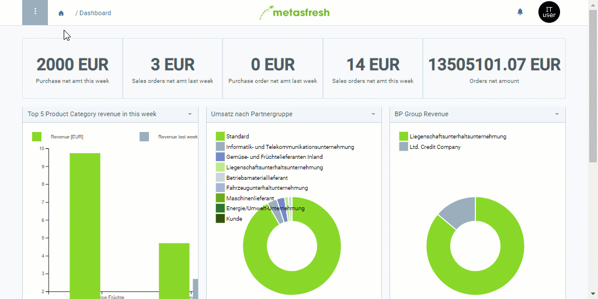

## Übersicht
In metasfresh kannst Du Handhabungseinheiten (engl.: *Handling Units - HU*) ganz einfach von einem Lager in ein anderes verbringen.

## Schritte
1. [Gehe ins Menü](Menu) und öffne das Fenster "Handling Unit Editor".
1. [Selektiere](AuswahlBelege) die Handling Units, die Du umlagern möchtest.
1. [Starte die Quick-Action](AktionStarten) "Lagerbewegung". Es öffnet sich ein Overlay-Fenster.
1. Gib im Feld **Lager** einen Teil des Lagernames ein und klicke auf eines der Ergebnisse.
 >**Hinweis 1:** Drücke die `LEERTASTE`, um alle [Lager](Neues_Lager_anlegen) zu sehen.  
 >**Hinweis 2:** Auswahl des Treffers mit Maus oder .

1. Klicke auf "Start", um das Overlay-Fenster zu schließen und die Umlagerung durchzuführen.
1. [metasfresh speichert automatisch](Speicheranzeige).
 >**Hinweis:** [Verwende die Filterfunktion](Filterfunktion), um die umgelagerten HUs schnell wiederzufinden.

## Beispiel

