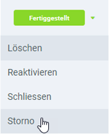

## Voraussetzungen
- [Erfasse eine Leergutausgabe](Leergutausgabe_erfassen).

## Schritte
1. [Gehe ins Menü](Menu) und öffne das Fenster "Leergut Ausgabe".
1. Öffne den Eintrag der Leergutausgabe, die Du stornieren möchtest, aus der [Listenansicht](Ansichten).
1. Öffne das [Belegverarbeitungsmenü](AktionStarten) (`Alt` + `I` / `⌥ alt` + `I`) und klicke auf *Storno*. 

1. Die Leergutausgabe wurde nun storniert. Im Textfeld **Beschreibung** findest Du die Belegnummer des Stornobelegs, welcher seinerseits die Belegnummer der stornierten Leergutausgabe als **Beschreibung** enthält. Außerdem werden hier alle stornierten Leergüter mit umgekehrtem Vorzeichen aufgeführt.

| **Hinweis:** |
| :--- |
| Den neu erstellten Stornobeleg findest Du unter dem Menüpunkt "[Leergut Ausgabe](Menu)" anhand seiner Belegnummer wieder. |

## Beispiel

