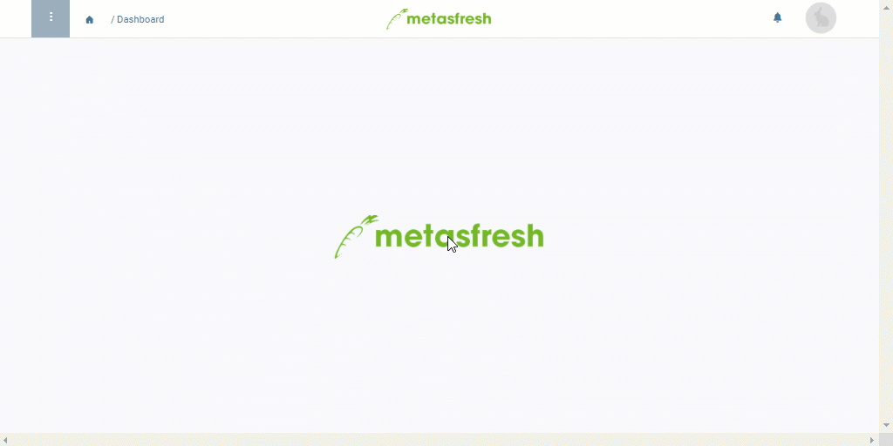

## Überblick
Leergutrücknahmen spielen dann eine Rolle, nachdem ein Kunde die von ihm bestellte Lieferware erhalten hat und die Packmittel, mit dem die gelieferten Produkte transportiert wurden (z.B. [Verpackungen wie Kisten oder Ladehilfsmittel wie Paletten](Handling_Unit_System)), zurückgeben möchte.

Die Rücknahme dieses Leergutes wird über die Wareneingangsdisposition abgewickelt und kann sowohl mit Bezug zu einer bestimmten Bestellung als auch gesondert geschehen.

## Schritte
1. [Gehe ins Menü](Menu) und öffne das Fenster "Wareneingangsdisposition".

### a) Gesonderte Leergutrücknahme
1. [Starte die Quick-Action](AktionStarten) "Leergutrücknahme". Es öffnet sich in demselben Tab das Fenster "[Leergutrücknahme](Menu)".
 >**Hinweis:** Diese Aktion findest Du ebenfalls im Aktionsmenü in der Listenansicht.

1. Gib im Feld **Geschäftspartner** einen Teil des Namens oder der Nummer des [Kunden](Neuer_Geschaeftspartner_Kunde) ein, der das Leergut zurückgibt, und klicke auf den passenden Treffer in der [Dropdown-Liste](Keyboard_Shortcuts_Liste).
 >**Hinweis:** Wird der gewünschte Partner nicht angezeigt, kannst Du ihn per [Schnellerfassung](Neuer_Geschaeftspartner_Schnellerfassung) neu anlegen.

### b) Bestellbezogene Leergutrücknahme
1. [Selektiere](AuswahlBelege) in der [Listenansicht](Ansichten) den Eintrag der [Bestellung](Bestellung_erfassen), zu der Du eine Leergutrücknahme erfassen möchtest.
1. [Starte die Quick-Action](AktionStarten) "Leergutrücknahme". Es öffnet sich in demselben Tab das Fenster "[Leergutrücknahme](Menu)".
 >**Hinweis:** Diese Aktion findest Du ebenfalls im Aktionsmenü sowohl in der Listenansicht als auch in der Einzelansicht eines Eintrags.

1. In diesem Eintrag sind bereits alle auftragsrelevanten Daten erfasst (siehe auch in der "[Erweiterten Erfassung](Ansichten)" des [Aktionsmenüs](AktionStarten)).

### Leergüter erfassen
1. Gehe zur Registerkarte "Position" unten auf der Seite und klicke auf , um die Leergüter zu erfassen.
 >**Hinweis:** Drücke `Alt` + `Q` / `⌥ alt` + `Q`.

1. Gib in das Feld **Packmittel** einen Teil des Namens des zurückzunehmenden [Packmittels](Packmittel_einrichten) ein und klicke auf den passenden Treffer in der [Dropdown-Liste](Keyboard_Shortcuts_Liste).
1. Gib eine **Menge** ein.
 >**Hinweis:** Wechsle in das Feld mit der Maus oder `Tab ↹`-Taste.

1. Drücke `↵ Enter`, um die Zeile hinzuzufügen.
 >**Hinweis:** Wiederhole die Schritte 1 bis 4 so oft, bis Du alle Packmittel erfasst hast.

 

| **Allgemeiner Hinweis:** |
| :--- |
| Es können auch negative Werte als **Menge** erfasst werden, wodurch eine Leergutrücknahme als [Leergutausgabe](Leergutausgabe_erfassen) verbucht werden kann, ohne diese in einem separaten Beleg erfassen zu müssen. Dies kann z.B. dann hilfreich sein, wenn Leergüter nicht akzeptiert werden können und an den Kunden retourniert werden müssen oder bei einem Leergutaustausch zwischen Lieferanten.   Um eine negative Menge zu erfassen, erfasse erst das Leergut mit positivem Wert und klicke dann doppelt auf das Feld **Menge** der Leergutzeile, um dort den positiven Wert zu einem negativen (`-`) umzuändern. |

### Leergutrücknahme fertigstellen
1. [Stelle den Beleg fertig](BelegverarbeitungFertigstellen).
1. [Öffne die PDF-Vorschau](PDFVorschau).

## Nächste Schritte (optional)
- [Storniere die Leergutrücknahme](Leergutruecknahme_stornieren).

## Beispiel

