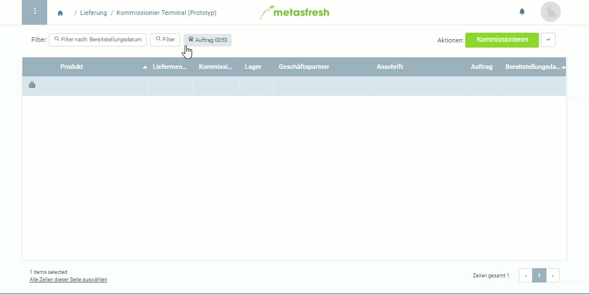

## Voraussetzungen
- [Kommissioniere einen Auftrag](Lieferung_kommissionieren).

## Schritte
1. Öffne den Eintrag eines [kommissionierten Auftrags](Lieferung_kommissionieren).
1. [Springe zur](SpringezuBelegen) "Lieferdisposition".
 >**Hinweis:** Drücke `Alt` + `6` / `⌥ alt` + `6`, um die Sidebar mit den verknüpften Belegen zu öffnen.

1. [Selektiere](AuswahlBelege) die Auftragszeilen, die Du liefern möchtest.
1. [Starte die Quick-Action](AktionStarten) "Auswahl liefern". Es öffnet sich ein Overlay-Fenster.
 >**Hinweis:** Diese Aktion findest Du ebenfalls im Aktionsmenü sowohl in der Listenansicht als auch in der Einzelansicht eines Eintrages.

1. Wähle im Feld **QuantityType** *Kommissionierte Menge* aus.
1. Klicke auf "Start", um zu bestätigen und das Overlay-Fenster zu schließen.
1. Du erhältst oben rechts eine [Benachrichtigung](Benachrichtigungsarten) , sobald die Lieferung erstellt ist.
1. Klicke auf die Benachrichtigung, um den Lieferschein zu öffnen.
1. [Öffne die PDF-Vorschau](PDFVorschau) des Belegs.

## Beispiel

