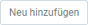

## Überblick
metasfresh verfügt derzeit über Schnittstellen für den Versand mit folgenden Dienstleistern (Lieferwege):
- Der Kurier
- <a href="#dhl-konfiguration" title="zur DHL-Konfiguration springen">DHL</a>
- <a href="#dpd-konfiguration" title="zur DPD-Konfiguration springen">DPD</a>
- GO! Express & Logistics

## Schritte
1. [Gehe ins Menü](Menu) und öffne das Fenster "Lieferweg".
1. Öffne den Eintrag eines bestehenden Lieferweges in der [Einzelansicht](Ansichten#einzelansicht), z.B. "DHL".
1. Trage die **Nachverfolgungs-URL** ein, die Dir vom Versanddienstleister bereitgestellt wurde.
1. Gehe zur Registerkarte des jeweiligen Lieferweges (z.B. "DHL Konfiguration") unten auf der Seite und klicke auf . Es öffnet sich ein Overlay-Fenster.

### <a name="dhl-konfiguration">DHL Konfiguration</a>

#### Voraussetzungen
1. Registriere dich über das <a href="https://developer.dhl.com/" title="DHL API Developer Portal" target="\_blank">DHL API Entwickler-Portal</a> und erstelle eine Applikation für `Parcel DE Shipping`.
1. Erstelle ein Konto über das <a href="https://geschaeftskunden.dhl.de/" title="DHL Geschäftskundenportal" target="\_blank">DHL Geschäftskundenportal</a>.

#### Einrichtung
1. Trage in das Feld **DHL API URL** die URL für die Anmeldung bei der DHL-Anwendungsschnittstelle (API) ein.
    >**Note:** Produktions-URL: <a href="https://api-eu.dhl.com/" title="DHL API Entwickler-Portal &#124; dhl.com" target="\_blank">https://api-eu.dhl.com/</a>

1. Trage die **Anwendungs-ID** ein, die Du von DHL für die Einrichtung erhalten hast. Diese entspricht dem `API-Schlüssel` in der Applikation.
1. Trage das **Anwendungs-Token** ein, das Du von DHL für die Einrichtung erhalten hast. Dieses entspricht dem `API-Secret` in der Applikation.
1. Trage die **Kontonummer** ein, die Du von DHL für die Einrichtung erhalten hast. Diese entspricht der Geschäftskontonummer. Sie endet mit `0101` für den Inlandsversand und mit `5301` für den internationalen Versand.
1. Trage in das Feld **Nutzer-ID/Login** Deinen Benutzernamen zur Kontoanmeldung ein.
1. Trage in das Feld **Unterschrift** Dein Passwort zur Kontoanmeldung ein.
1. Klicke auf "Bestätigen", um das Overlay-Fenster zu schließen und die Konfigurationen zur Liste hinzuzufügen.

---

### <a name="dpd-konfiguration">DPD Konfiguration</a>
1. Trage in das Feld **URL Api Login** die URL für die <a href="http://diswiki.dpd.nl/wiki/2/login-service" title="dpd Login Service" target="\_blank">Anmeldung und Authentifizierung</a> gegenüber der DPD-Anwendungsschnittstelle ein.
1. Trage in das Feld **URL Api Shipment Service** die URL für den Zugriff auf die <a href="http://diswiki.dpd.nl/wiki/3/shipment-service" title="dpd Shipment Service" target="\_blank">Versandschnittstelle</a> ein, über die die Versandscheine generiert werden.
1. Trage die **Delis ID** ein, die Du von DPD für die Einrichtung erhalten hast.
1. Trage das **Delis Passwort** ein, das Du von DPD für die Einrichtung erhalten hast.
1. Wähle ein **Papierformat** für die Versandscheine aus.
1. Klicke auf "Bestätigen", um das Overlay-Fenster zu schließen und die Konfigurationen zur Liste hinzuzufügen.

| **Wichtiger Hinweis:** |
| :--- |
| Folgende DPD-Dienste stehen derzeit zur Verfügung:  •&nbsp;<a href="https://www.dpd.com/de/de/versenden/paketversand/" title="DPD CLASSIC Paketversand" target="\_blank">DPD CLASSIC</a> (in Deutschland und ganz Europa)  •&nbsp;<a href="https://www.dpd.com/de/de/versenden/expressversand/" title="DPD Expressversand" target="\_blank">DPD EXPRESS E12</a> (innerhalb Deutschlands) |

## Nächste Schritte
- [Richte einen Lieferweg Deiner Wahl als Standardlieferweg für einen bestimmten Kunden ein](GPartner_Standardlieferweg_einrichten).
- [Verwende den Lieferweg in einem Transportauftrag](Transportauftrag_erstellen).
