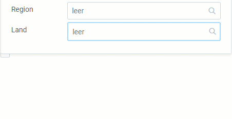

## Übersicht
In metasfresh kannst Du in verschiedenen Kontexten einige Prozesse mithilfe bestimmter Tastenkombinationen beschleunigen. Hier findest Du eine Liste der Tastaturbefehle.

### Globaler Kontext

| Tastenkombination   (Windows) | Tastenkombination   (MacOS) | Befehl |
| :---: | :---: | :--- |
| `Alt` + `1` | `⌥ alt` + `1` | Aktionsmenü öffnen  |
| `Alt` + `2` | `⌥ alt` + `2` | Navigationsmenü öffnen  |
| `Alt` + `3` | `⌥ alt` + `3` | Nachrichtenbox öffnen  |
| `Alt` + `4` | `⌥ alt` + `4` | Nutzermenü öffnen  |
| `Alt` + `5` | `⌥ alt` + `5` | Dokumentenliste öffnen (Sidebar)  |
| `Alt` + `6` | `⌥ alt` + `6` | Liste der verknüpften Belege öffnen (Sidebar)  |
| `Alt` + `7` | `⌥ alt` + `7` | Anhangliste öffnen (Sidebar)  |
| `Alt` + `↵ Enter` | `⌥ alt` + `↵ Enter` | Auswahl öffnen / Anwenden ("Bestätigen") / Filter anwenden |
| `Esc` | `esc` | Abbrechen |

### Kontext: Dynamisches Suchfeld (Autocomplete)
Dynamische Suchfelder sind durchsuchbare Dropdown-Listen, die sich mit jeder Eingabe eines Buchstaben in das Textfeld aktualisieren und eine Auswahl möglicher Treffer anzeigen, welche dann zwecks Autovervollständigung durch Anklicken ausgewählt werden können.

| Tastenkombination   (Windows/MacOS) | Befehl |
| :---: | :--- |
| `LEERTASTE` | Auswahl verfügbarer Dateneinträge anzeigen.  (Treffer mit Maus oder  auswählen.) |

**Beispiel**: Dynamische Dropdown-Liste  

### Kontext: Dokument ([Listenansicht](Ansichten))

| Tastenkombination   (Windows) | Tastenkombination   (MacOS) | Befehl |
| :---: | :---: | :--- |
| `Alt` + `A` | `⌥ alt` + `A` | Alle Zeilen auswählen bzw. zwischen "Alle Zeilen dieser Seite auswählen" und "Wähle alle ## Zeilen" wechseln |
| `Alt` + `B` | `⌥ alt` + `B` | Ausgewähltes Dokument in neuem Tab öffnen |
| `Alt` + `E` | `⌥ alt` + `E` | "Erweiterte Erfassung" für ausgewähltes Dokument öffnen |
| `Alt` + `Y` | `⌥ alt` + `Y` | Ausgewähltes Dokument löschen |

### Kontext: Dokument ([Einzelansicht](Ansichten))

| Tastenkombination   (Windows) | Tastenkombination   (MacOS) | Befehl |
| :---: | :---: | :--- |
| `Alt` + `D` | `⌥ alt` + `D` | Dokument löschen |
| `Alt` + `E` | `⌥ alt` + `E` | "Erweiterte Erfassung" öffnen |
| `Alt` + `I` | `⌥ alt` + `I` | Belegverarbeitungsmenü öffnen (Aktionsbutton für Belegstatus) |
| `Alt` + `K` | `⌥ alt` + `K` | E-Mail-Editor öffnen |
| `Alt` + `N` | `⌥ alt` + `N` | Neues Dokument anlegen |
| `Alt` + `P` | `⌥ alt` + `P` | Druckvorschau öffnen |
| `Alt` + `U` | `⌥ alt` + `U` | Belegstatus auf "Fertiggestellt" setzen |
| `Alt` + `W` | `⌥ alt` + `W` | Dokument klonen |

### Kontext: Registerkarte (im Dokument)

| Tastenkombination   (Windows) | Tastenkombination   (MacOS) | Befehl |
| :---: | :---: | :--- |
| `Alt` + `E` | `⌥ alt` + `E` | "Erweiterte Erfassung" für ausgewählte Zeile öffnen |
| `Alt` + `Q` | `⌥ alt` + `Q` | Auftragszeileneingabe (Massenerfassung) öffnen |
| `Alt` + `Y` | `⌥ alt` + `Y` | Ausgewählte Zeile löschen |
| `Alt` + `+` | `⌥ alt` + `+` | Registerkarte erweitern / reduzieren |

### Kontext: [Quick-Actions](AktionStarten)

| Tastenkombination   (Windows) | Tastenkombination   (MacOS) | Befehl |
| :---: | :---: | :--- |
| `Alt` + `L` | `⌥ alt` + `L` | Quick-Actions-Menü öffnen |
| `Alt` + `U` | `⌥ alt` + `U` | Angezeigte Quick-Action ausführen |

### Kontext: Listenansicht mit mehreren Seiten

| Tastenkombination   (Windows) | Tastenkombination   (MacOS) | Befehl |
| :---: | :---: | :--- |
| `PAGEDOWN` | `Fn` + `↓` | Umblättern auf nächste Seite |
| `PAGEUP` | `Fn` + `↑` | Zurückblättern auf vorherige Seite |
| `HOME` | `Fn` + `←` | Auf erste Seite springen |
| `END` | `Fn` + `→` | Auf letzte Seite springen |

### Kontext: Listenansicht mit Unterpunkten

| Tastenkombination   (Windows) | Tastenkombination   (MacOS) | Befehl |
| :---: | :---: | :--- |
| `+` | `+` | Einzüge aufklappen |
| `-` | `-` | Einzüge zusammenklappen |
| `Alt` + `S` | `⌥ alt` + `S` | Alle Zeilen selektieren |

**Beispiel**: Handling Unit Editor  

