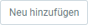

## Überblick
Ein logischer Drucker ist eine **benannte Kombination von Druckereinstellungen** für einen physischen Drucker, anhand derer die Erstellung und/oder Verteilung elektronischer Dokumente ausgelöst wird. Es kann mehr als ein logischer Drucker für denselben physischen Drucker definiert werden. Ein **physischer Drucker** kann ein tatsächlicher (Hardware-)Drucker, eine Datei oder ein Folgeprozess zur Weiterverarbeitung sein.

Logische Drucker enthalten **spezifische Attribute und Konfigurationen**, die die Druckeigenschaften und -formate der für physische Drucker bestimmten Dokumente festlegen. Zudem ist es möglich, logische **Druckerschächte** zu definieren und diese mit bestimmten Regeln zur **Weiterleitung von Dokumenten** an den entsprechenden Schacht zu versehen. Natürlich können diese logischen Schächte auch mit physischen Dokumentenausgabeschächten verknüpft werden.

## Schritte

### Logischen Drucker konfigurieren
1. [Gehe ins Menü](Menu) und öffne das Fenster "Logischer Drucker".
1. [Erstelle einen neuen Eintrag](Neuer_Datensatz_Fenster_Webui).
1. Gib dem **Drucker** einen Namen.
1. Wähle einen **Druckertyp** (engl.: *Printer Type*) aus, z.B. *General*, *Label*, *Fax*.

### Logische Druckerschächte hinzufügen (optional)
1. Gehe zur Registerkarte "Schacht" unten auf der Seite und klicke auf . Es öffnet sich ein Overlay-Fenster.
1. Benenne den Schacht im Feld **Name**.
1. Klicke auf "Bestätigen", um das Overlay-Fenster zu schließen und den logischen Schacht zur Liste hinzuzufügen.
 >**Hinweis:** Du kannst auf diese Weise beliebig viele Schächte hinzufügen.

### Kriterien definieren für die Weiterleitung von Belegen an einen logischen Schacht (optional)
Zu druckende Dokumente werden auf Grundlage der hier definierten Einstellungskombinationen (Regeln/Logik) an den jeweiligen Druckerschacht weitergeleitet.

1. Gehe zur Registerkarte "Zuordnung" unten auf der Seite und klicke auf . Es öffnet sich ein Overlay-Fenster.
1. Wähle eine Kombination von Belegattributen, z.B. **Belegart**, **Prozess**, **Rolle**, **Nutzer**, **DB-Tabelle** usw.
1. ***Optional:*** Im Feld **Seiten-Kriterium** kannst du einen Seitenbereich *Seiten von-bis* oder *Letzte Seiten* auswählen.
    - *Seiten von-bis*: Gib die Zahl der **Von Seite** und der **Bis Seite** an.
    - *Letzte Seiten*: Gib die Anzahl der **Letzten Seiten** an.
1. Wähle einen **Logischen Schacht** für die Dokumentenausgabe aus.
1. Klicke auf "Bestätigen", um das Overlay-Fenster zu schließen und die Schachtzuordnung zur Liste hinzuzufügen.
 >**Hinweis:** Du kannst auf diese Weise beliebig viele Schachtzuordnungen hinzufügen.

## Nächste Schritte
1. [Konfiguriere einen PDF/physischen Drucker](PDF_Drucker_Konfiguration_WebUI).
1. [Ordne logische und physische Drucker zu](Zuordnung_logische_und_physische_Drucker).
1. [Ordne logische und physische Druckerschächte zu, falls vorhanden](Zuordnung_logische_und_physische_Druckerschaechte).
1. [Teste die Druckerkonfigurationen mit einem Testdruck](PDF_Drucker_Einrichtung_Guide#testdruck).
