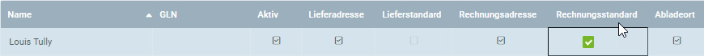
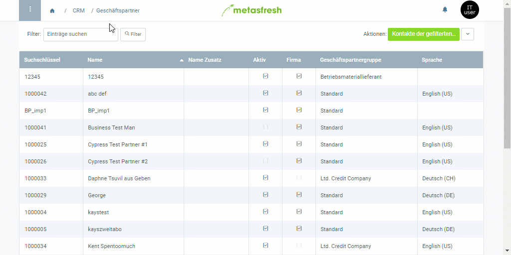

## Übersicht
Kontakte, die Du in die Verteilerliste einer [Marketingkampagne](MKTG-Kampagne_erstellen) aufnehmen möchtest, müssen als [Nutzer](Nutzer_anlegen) in Deinem System registriert und [mit einem Geschäftspartner verknüpft](Nutzer_GPartner_zuweisen) sein.

Möchtest Du [Geschäftspartner](Neuer_Geschaeftspartner) in die Verteilerliste einer Marketingkampagne aufnehmen, musst Du ihrem Eintrag erst einen [Nutzer hinzufügen](GPartner_Nutzer_hinzufuegen).

| **Allgemeiner Hinweis:** |
| :- |
| Damit Kontakte (Nutzer bzw. Geschäftspartner) in die Verteilerliste der Marketingkampagne aufgenommen werden können, muss im [Geschäftspartnereintrag eine Adresse](Adresse_erfassen_Tab) als **Rechnungsstandard** angegeben sein.   |

## Schritte

### Kontakte hinzufügen

#### a) Kontakte aus Geschäftspartnern
1. [Gehe ins Menü](Menu) und öffne das Fenster "Geschäftspartner".
1. [Selektiere](AuswahlBelege) in der [Listenansicht](Ansichten) die [Geschäftspartner](Neuer_Geschaeftspartner), die Du Deiner Marketingkampagne als Kontakte hinzufügen möchtest.
1. [Starte die Quick-Action](AktionStarten) "Export in E-Mail-Kampagne". Es öffnet sich ein Overlay-Fenster.
 >**Hinweis:** Diese Aktion findest Du ebenfalls im Aktionsmenü sowohl in der Listenansicht als auch in der Einzelansicht eines Eintrags.

#### b) Kontakte aus Nutzern
1. [Gehe ins Menü](Menu) und öffne das Fenster "Nutzer".
1. [Selektiere](AuswahlBelege) in der [Listenansicht](Ansichten) die [Nutzer](Nutzer_anlegen), die Du Deiner Marketingkampagne als Kontakte hinzufügen möchtest.
1. [Starte die Quick-Action](AktionStarten) "Gefilterte Kontakte in Kampagne". Es öffnet sich ein Overlay-Fenster.
 >**Hinweis:** Diese Aktion findest Du ebenfalls im Aktionsmenü sowohl in der Listenansicht als auch in der Einzelansicht eines Eintrags.

### Marketingkampagne auswählen
1. Gib im Feld **MKTG_Campaign** einen Teil der Marketingkampagne ein und klicke auf eines der Ergebnisse.
 >**Hinweis 1:** Drücke die `LEERTASTE`, um alle verfügbaren [Marketingkampagnen](MKTG-Kampagne_erstellen) zu sehen.  
 >**Hinweis 2:** Auswahl des Treffers mit Maus oder .

1. Klicke auf "Start", um das Overlay-Fenster zu schließen und die Kontakte zur Marketingkampagne hinzufügen.
 

| **Hinweis:** |
| :- |
| Die Kontakte findest Du nun unter dem Menüpunkt "[Marketing Kampagne](Menu)" in der Registerkarte "Kontaktperson" unten auf der Seite des Eintrags der jeweiligen Marketingkampagne wieder. |

## Beispiel

