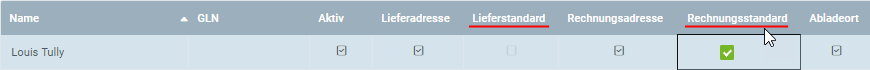

## Überblick
Kontakte, die Du in die Verteilerliste einer [Marketingkampagne](MKTG-Kampagne_erstellen) aufnehmen möchtest, müssen als [Nutzer](Nutzer_anlegen) in metasfresh registriert sein. 
Möchtest Du [Geschäftspartner](Neuer_Geschaeftspartner) in die Verteilerliste einer Marketingkampagne aufnehmen, musst Du deren Eintrag erst einen [Nutzer hinzufügen](GPartner_Nutzer_hinzufuegen).

### Voraussetzungen für E-Mail-Kampagnen
Damit Kontakte (Nutzer bzw. Geschäftspartner) in die Verteilerliste einer *E-Mail-Kampagne* aufgenommen werden können, muss im [Nutzereintrag eine E-Mail-Adresse](Nutzer_anlegen) angegeben sein.

### <a name="voraussetzungen-serienbrief-kampagnen">Voraussetzungen für Serienbrief-Kampagnen</a>
Damit Kontakte (Nutzer bzw. Geschäftspartner) in die Verteilerliste einer [*Serienbrief-Kampagne*](Serienbriefe_erstellen) aufgenommen werden können, muss im [Geschäftspartnereintrag eine Standardadresse](Adresse_erfassen_Tab) angegeben sein, z.B. *Lieferstandard* oder *Rechnungsstandard*. Hierzu muss ein Nutzer gegebenenfalls erst noch [mit einem Geschäftspartner verknüpft](Nutzer_GPartner_zuweisen) werden. 
<kbd></kbd>

## Schritte

### Kontakte aus Geschäftspartnern

#### a) in E-Mail-Kampagne exportieren
1. [Gehe ins Menü](Menu) und öffne das Fenster "Geschäftspartner".
1. [Selektiere](AuswahlBelege) in der [Listenansicht](Ansichten#listenansicht) die [Geschäftspartner](Neuer_Geschaeftspartner), die Du Deiner E-Mail-Kampagne als Kontakte hinzufügen möchtest.
1. [Starte die Quick-Action](AktionStarten#quick-actions) "Export in E-Mail-Kampagne". Es öffnet sich ein Overlay-Fenster.
 >**Hinweis:** Diese Aktion findest Du ebenfalls im Aktionsmenü sowohl in der Listenansicht als auch in der Einzelansicht eines Eintrages.

1. Gib im Feld [**MKTG_Campaign**](MKTG-Kampagne_erstellen) einen Teil der E-Mail-Kampagne ein und klicke auf den passenden Treffer in der <a href="Keyboard_Shortcuts_Liste#dropdown" title="Dynamisches Suchfeld (Autocomplete)">Dropdown-Liste</a>.
1. Klicke auf "Start", um das Overlay-Fenster zu schließen und die Kontakte zur E-Mail-Kampagne hinzuzufügen.

#### b) in Serienbrief-Kampagne exportieren
1. [Gehe ins Menü](Menu) und öffne das Fenster "Geschäftspartner".
1. [Selektiere](AuswahlBelege) in der [Listenansicht](Ansichten#listenansicht) die [Geschäftspartner](Neuer_Geschaeftspartner), die Du Deiner Serienbrief-Kampagne als Kontakte hinzufügen möchtest.
1. [Starte die Aktion](AktionStarten#aktionsmenue) "Export in Serienbrief-Kampagne". Es öffnet sich ein Overlay-Fenster.
 >**Hinweis:** Diese Aktion findest Du ebenfalls im Aktionsmenü in der Einzelansicht eines Eintrages.

1. Gib im Feld [**MKTG_Campaign**](MKTG-Kampagne_erstellen) einen Teil der Serienbrief-Kampagne ein und klicke auf den passenden Treffer in der <a href="Keyboard_Shortcuts_Liste#dropdown" title="Dynamisches Suchfeld (Autocomplete)">Dropdown-Liste</a>.
1. Wähle im Feld **DefaultAddressType** die Art der Standardadresse aus, an die die Serienbriefe später gesendet werden sollen, z.B. *BillToDefault* (Rechnungsstandard) oder *ShipToDefault* (Lieferstandard).
 >**Hinweis:** Stelle sicher, dass unter der Registerkarte "Adresse" des jeweiligen Geschäftspartnereintrages die entsprechenden Felder in der entsprechenden Zeile aktiviert sind (<a href="#voraussetzungen-serienbrief-kampagnen" title="Voraussetzungen für Serienbrief-Kampagnen">siehe oben</a>).

1. Klicke auf "Start", um das Overlay-Fenster zu schließen und die Kontakte zur Serienbrief-Kampagne hinzuzufügen.

---

### Kontakte aus Nutzern

| **Besonderer Hinweis:** |
| :--- |
| Bei Nutzern kann man nicht unabhängig voneinander zwischen den Aktionen *Export in E-Mail-* oder *Serienbrief-Kampagne* wählen. Ob also eine E-Mail- oder Standardadresse benötigt wird, hängt daher von der Art der Marketingkampagne bzw. den Einstellungen der [Marketing-Plattform](MKTG-Plattform_erstellen) ab.  Für eine *E-Mail-Kampagne* muss im Nutzereintrag eine **E-Mail-Adresse** angegeben sein! Eine Verknüpfung mit einem Geschäftspartner ist in diesem Fall nicht erforderlich.  Bei einer *Serienbrief-Kampagne* muss der Nutzer jedoch [mit einem Geschäftspartner verknüpft](Nutzer_GPartner_zuweisen) sein, der seinerseits wiederum über eine Adresse als **Rechnungsstandard** verfügen muss! |

1. [Gehe ins Menü](Menu) und öffne das Fenster "Nutzer".
1. [Selektiere](AuswahlBelege) in der [Listenansicht](Ansichten#listenansicht) die [Nutzer](Nutzer_anlegen), die Du Deiner Marketingkampagne als Kontakte hinzufügen möchtest.
1. [Starte die Quick-Action](AktionStarten#quick-actions) "Gefilterte Kontakte in Kampagne". Es öffnet sich ein Overlay-Fenster.
 >**Hinweis:** Diese Aktion findest Du ebenfalls im Aktionsmenü sowohl in der Listenansicht als auch in der Einzelansicht eines Eintrages.

1. Gib im Feld **MKTG_Campaign** einen Teil der [Marketingkampagne](MKTG-Kampagne_erstellen) ein und klicke auf den passenden Treffer in der <a href="Keyboard_Shortcuts_Liste#dropdown" title="Dynamisches Suchfeld (Autocomplete)">Dropdown-Liste</a>.
1. Klicke auf "Start", um das Overlay-Fenster zu schließen und die Kontakte zur Marketingkampagne hinzuzufügen.
  

| **Allgemeiner Hinweis:** |
| :--- |
| Die hinzugefügten Kontakte findest Du nun unter dem Menüpunkt "[Marketing Kampagne](Menu)" unter der Registerkarte "Kontaktperson" unten auf der Seite des Eintrages der jeweiligen Marketingkampagne wieder. |

## Beispiel
<kbd></kbd>
