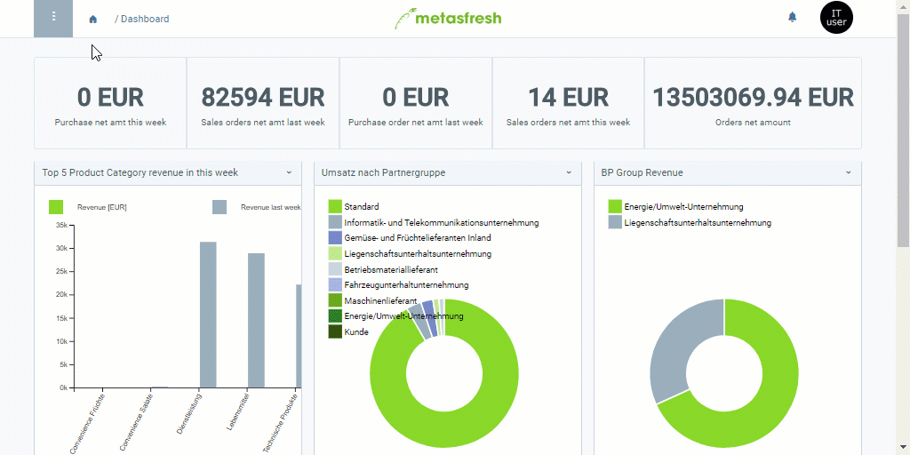

## Übersicht
Mittels einer Marketingkampagne kannst Du Serienbriefe erstellen, um mit wenig Aufwand eine Vielzahl Deiner Kontakte auf einmal mit für sie interessanten Informationen zu versorgen.

## Schritte
1. [Gehe ins Menü](Menu) und öffne das Fenster "Marketing Kampagne".
1. [Lege eine neue Marketingkampagne an](Neuer_Datensatz_Fenster_Webui).
1. Benenne die Marketingkampagne im Feld **Name**.
1. Gib im Feld **Marketing Platform** einen Teil der Marketing-Plattform ein und klicke auf eines der Ergebnisse, z.B. *CleverReach*.
 >**Hinweis 1:** Drücke die `LEERTASTE`, um alle verfügbaren [Marketing-Plattformen](MKTG-Plattform_erstellen) zu sehen.  
 >**Hinweis 2:** Auswahl des Treffers mit Maus oder .

1. Wähle einen [**Textbaustein**](Textbaustein_erstellen) aus.
1. [metasfresh speichert automatisch](Speicheranzeige).

## Beispiel

