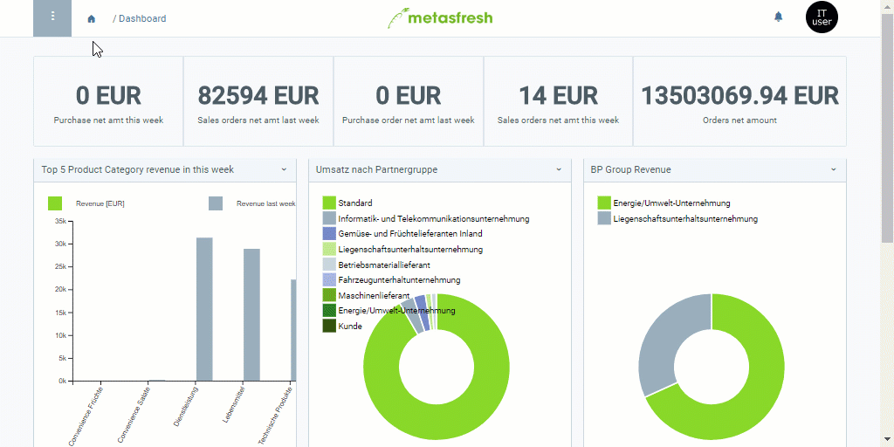

## Übersicht
Mittels der Marketing-Plattform kannst Du festlegen, welche Adressart beim [Hinzufügen von Kontakten in eine Marketingkampagne](MKTG-Kampagne_Kontakte_hinzufuegen) verwendet werden soll. Du hast die Wahl zwischen der [*Standardadresse des Geschäftspartners*](Adresse_erfassen_Tab) (**Requires Location**) und der [*E-Mail-Adresse des Nutzers*](Nutzer_anlegen) (**Requires Mail Address**). Selbstverständlich kannst Du auch beide Adressarten miteinander kombinieren.

Wählst Du **Requires Location** aus, dann handelt es sich anschließend bei der Kampagne um eine [*Serienbrief-Kampagne*](Serienbriefe_erstellen), in die nur diejenigen Kontakte aufgenommen werden, für die in metasfresh eine Standardadresse hinterlegt ist (Geschäftspartner).

Wählst Du **Requires Mail Address** aus, dann handelt es sich anschließend bei der Kampagne um eine *E-Mail-Kampagne*, in die nur diejenigen Kontakte aufgenommen werden, für die in metasfresh eine E-Mail-Adresse hinterlegt ist (Nutzer).

## Schritte
1. [Gehe ins Menü](Menu) und öffne das Fenster "Marketing Platform".
1. [Lege eine neue Marketing-Plattform an](Neuer_Datensatz_Fenster_Webui).
1. Wähle eine **Marketing Platform Gateway ID** aus, z.B. *CleverReach*.
1. Benenne die Marketing-Plattform im Feld **Name**.
1. Setze ein Häkchen je nach Bedarf entweder bei **Requires Location**, **Requires Mail Address** oder bei beiden Kontrollkästchen.
1. [metasfresh speichert automatisch](Speicheranzeige).

## Beispiel

