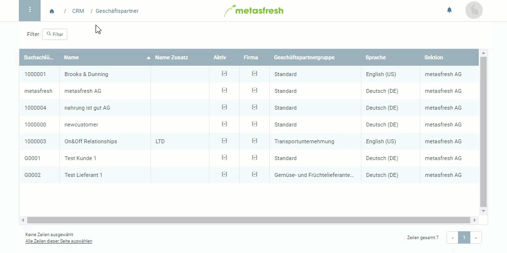
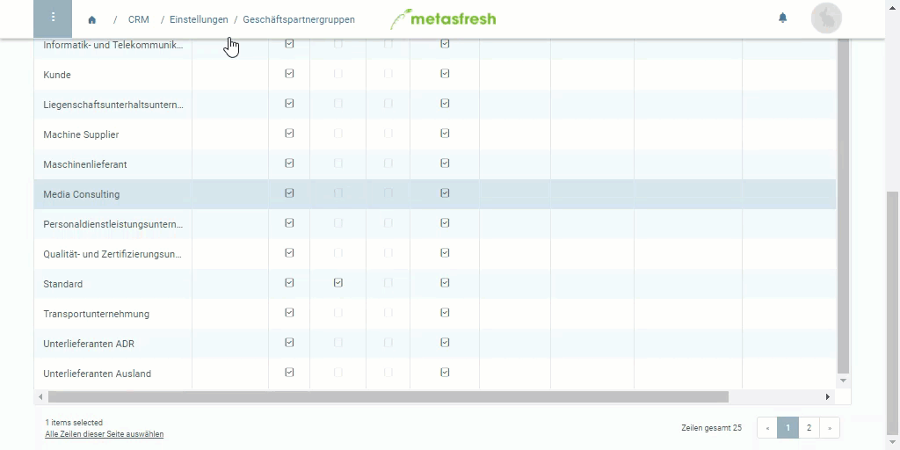

## Überblick
Damit eine Mahnart in Verbindung mit einem Partner wirksam wird, musst Du sie erst mit dem entsprechenden Partner verknüpfen. Du kannst sie sowohl mit einem einzelnen Kunden als auch mit einer Geschäftspartnergruppe verknüpfen.

## Mahnart mit einzelnem Kunden verknüpfen

### Schritte
1. Öffne den Eintrag eines bestehenden Kunden aus Deinen [Geschäftspartnern](Menu) bzw. [lege einen neuen an](Neuer_Geschaeftspartner_Kunde).
1. Gehe zur Registerkarte "Kunde" unten auf der Seite und öffne die "[Erweiterte Erfassung](AdvancedEditTab_Öffnen)" der Kundenzeile.
 >**Hinweis:** Der Geschäftspartner muss als Kunde registriert sein, damit die Mahnfunktion verfügbar wird.

1. Im Feld **Mahnung** kannst Du die gewünschte Mahnart einstellen.
1. Klicke auf "Bestätigen", um die Änderungen zu übernehmen und die "Erweiterte Erfassung" zu schließen.
 >**Hinweis:** Alternativ kannst Du auch doppelt auf das Feld in der Spalte **Mahnung** der Kundenzeile klicken und aus der Dropdown-Liste eine Mahnart auswählen.

### Beispiel

---

## Mahnart mit Geschäftspartnergruppe verknüpfen

### Schritte
1. Öffne den Eintrag einer bestehenden [Geschäftspartnergruppe](Menu) bzw. [lege eine neue an](Neue_Geschaeftspartnergruppe).
1. Öffne die "[Erweiterte Erfassung](Ansichten#erw-erfassung)" aus dem [Aktionsmenü](AktionStarten#aktionsmenue).
 >**Hinweis:** Drücke `Alt` + `E` / `⌥ alt` + `E`.

1. Scrolle runter bis zum Feld **Mahnung** und wähle die gewünschte Mahnart aus.
1. Klicke auf "Bestätigen", um die Änderungen zu übernehmen und die "Erweiterte Erfassung" zu schließen.

### Beispiel

