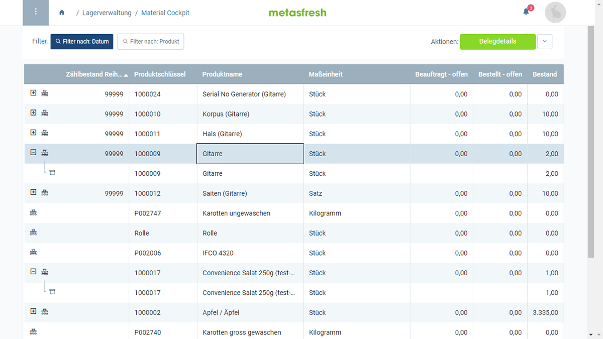

## Überblick
In metasfresh kannst du über das sogenannte **Material Cockpit** (oder Handelsbord) die Bestände deiner Produkte auf Lager sowie weitere Bestands- und Belegdetails einsehen und verwalten wie z.B. die [höchsten Einkaufspreise](Material-Cockpit-hoechster-einkaufspreis).

## Schritte
1. [Gehe ins Menü](Menu) und öffne das Fenster "Material Cockpit".
1. [Verwende die Filterfunktion](Filterfunktion), um Dir bei der Suche nach bestimmten [Handling Units (HUs)](Handling_Unit_System) zu helfen.
1. HU-Einträge mit mehreren Ebenen ([CU/TU/LU](Handling_Unit_System)) kannst du u.a. auch mithilfe des [Keyboards auf- und zuklappen](Keyboard_Shortcuts_Liste#listenelemente-verwalten) (`+`/`-`).

## Nächste Schritte (optional)
- [Erfasse Bestandsmengen mittels einer Inventur](Inventur_HUs_erstellen) oder füge neue [Handling Units](Handling_Unit_System) dem Bestand hinzu.
- [Füge der Listenansicht eine Spalte für den höchsten Einkaufspreis hinzu. (Systemadministrator)](Material-Cockpit-hoechster-einkaufspreis)

## Beispiel
<kbd></kbd>
