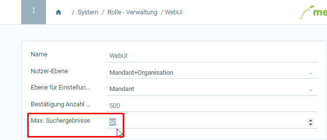

## Überblick
Du kannst die Suchergebnisse, die einem Nutzer in der Listenansicht angezeigt werden, auf ein Maximum beschränken. Gehe hierzu wie folgt vor:

## Schritte
1. [Gehe ins Menü](Menu) und öffne das Fenster "Rolle - Verwaltung".
1. Öffne den Eintrag einer bestehenden Nutzerrolle bzw. [lege eine neue an](NeueBenutzerrolle).
1. Trage bei **Max. Suchergebnisse** eine Zahl ein, z.B. "50". 

1. Zukünftig werden diesem Nutzer nun alle Suchergebnisse oberhalb dieses Limits nicht mehr angezeigt. Dies erkennt man in der [Listenansicht](Ansichten#listenansicht) dann unten rechts an der Paginierung: .
