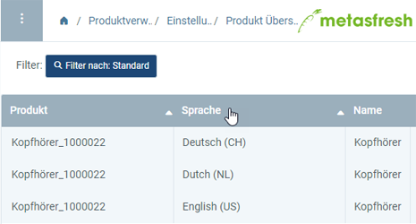
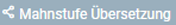
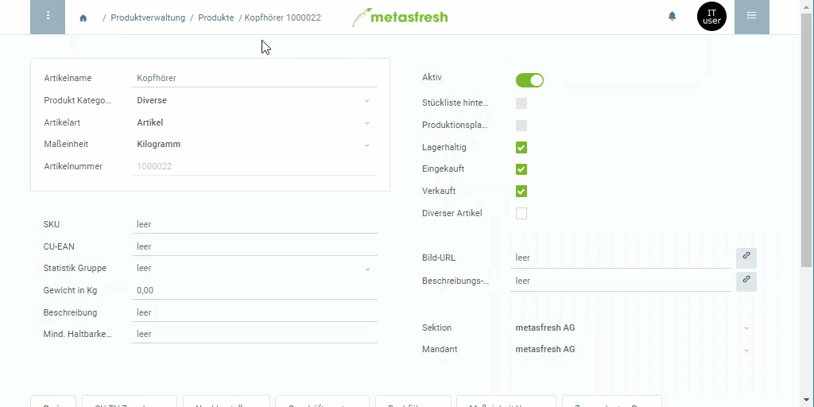

## Übersicht
In metasfresh kannst Du viele Deiner Daten sowohl für die *interne* als auch für die *externe* Datenverwaltung eigenständig in die Sprachen Deiner Geschäftspartner übersetzen.

Derzeit können die Dateneinträge der folgenden Menüpunkte übersetzt werden:
- Anreden
- Aufgabentyp / Vorgangsart
- Belegart
- [Mahnstufe](Mahnart_definieren)\*
- Maßeinheit
- Nährwert
- [Produkt](NeuesProdukt) (inkl. [Produktbeschreibung](Text_auf_Belege_drucken-Produkt))
- [Produktkategorie](NeueProduktkategorie)
- Steuerkategorie
- Steuersatz
- [Stückliste](Stueckliste_erstellen)
- Zahlungsbedingung

Sobald Du einen [neuen Dateneintrag angelegt](Neuer_Datensatz_Fenster_Webui) hast, werden in den entsprechenden Übersetzungsfenstern im Menü mehrsprachige Einträge erstellt, in denen Du anschließend Deine Übersetzungen bearbeiten kannst.

Legst Du z.B. [ein neues Produkt an](NeuesProdukt), kannst Du unter dem Menüpunkt “Produkt Übersetzung” dessen Übersetzungseinträge bearbeiten.

Wenn Du nun die [Sprache Deiner Benutzeroberfläche änderst](SwitchLanguage) und z.B. einen [Auftrag erstellst](Auftrag_erfassen), wird Dir bei der Massenerfassung der Produktname in der jeweilig eingestellten Sprache angezeigt.

Oder wenn Du [Belege druckst](PDFVorschau) für anderssprachige Geschäftspartner, dann wird der in deren Sprachen entsprechend übersetzte Produktname auf diesen Belegen aufgeführt.

## Schritte

### Übersetzungseintrag öffnen

#### a) Über das Navigationsmenü
1. [Gehe ins Menü](Menu) und öffne das Übersetzungsfenster des jeweiligen Eintrags, z.B. "Produkt Übersetzung".
1. [Verwende die Filterfunktion](Filterfunktion), um denjenigen Eintrag zu finden, für den Du eine Übersetzung anlegen möchtest. Für jede verfügbare Sprache gibt es einen eigenen Eintrag (siehe Tabellenspalte **Sprache**).  

#### b) Aus dem Eintrag über die Sidebar springen
Hast Du den zu übersetzenden Eintrag bereits geöffnet, z.B. den eines Produkts, dann gehe wie folgt vor:

1. [Springe über die verknüpften Belege](SpringezuBelegen) des Eintrags in das jeweilige Übersetzungsfenster, z.B. "Produkt Übersetzung" unter PRODUKTVERWALTUNG in der Sidebar.
1. In diesem Fenster werden Dir alle Übersetzungseinträge für den ausgewählten Eintrag angezeigt.

#### c) Aus der Registerkarte über das Kontextmenü springen\*
Möchtest Du Registerkarteneinträge übersetzen, wie z.B. im Falle der Mahnstufe, dann gehe wie folgt vor:

1. Gehe zur Registerkarte unten auf der Seite, z.B "Stufen" für die Mahnstufen im Fenster der jeweiligen [Mahnart](Menu), und selektiere die Zeile, für die Du eine Übersetzung anlegen möchtest.
1. [Springe über das Kontextmenü](Springezu_Kontextmenue) in das entsprechende Übersetzungsfenster, z.B. . Hier siehst Du nun eine Liste aller Übersetzungseinträge für den ausgewählten Eintrag.

### Übersetzungen anlegen
1. Öffne den Eintrag der Sprache, in die Du übersetzen möchtest, z.B. "English (US)".
1. Ersetze im Feld **Name** die vorhandene Benennung mit Deiner Übersetzung.
 >**Hinweis:** Dieser Schritt entfällt für "Mahnstufe".

1. ***Sofern vorhanden:*** Ersetze im Feld **Drucktext** die vorhandene Benennung mit Deiner Übersetzung.
 >**Hinweis:** Dieser Schritt betrifft "Belegart" und "Mahnstufe".

1. ***Sofern vorhanden:*** Gib im Feld **Name auf Rechnung** die Benennung ein, die auf der Rechnung erscheinen soll.
 >**Hinweis:** Dieser Schritt betrifft nur "Zahlungsbedingung".

1. Setze ein Häkchen bei **Übersetzt**.
1. [metasfresh speichert automatisch](Speicheranzeige).
  

| **Allgemeiner Hinweis:** |
| :- |
| Die Änderungen im Feld **Name** wirken sich grundsätzlich sowohl auf die *internen* als auch auf die *externen* Daten aus. Das heißt, je nach [Spracheinstellung der Benutzeroberfläche](SwitchLanguage) bzw. Sprache des [Geschäftspartners](Neuer_Geschaeftspartner) wird dann der **Name** in der jeweiligen Sprache dargestellt bzw. auf die Belege gedruckt. Ausnahmen bilden hierbei die Dateneinträge der Menüpunkte "Belegart" und "Mahnstufe".  Für "Belegart" bestimmt das Feld **Name** lediglich die *interne* Benennung des Dateneintrags. Die *externe* Benennung wird über das zusätzliche Feld **Drucktext** verwaltet, wie es auch für "Mahnstufe" der Fall ist. Allerdings wird der *interne* Name der Mahnstufe im Eintrag der jeweiligen [Mahnart](Mahnart_definieren) verwaltet. |

## Beispiel

