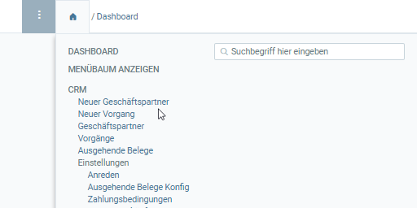
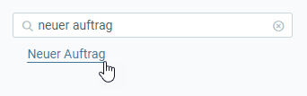
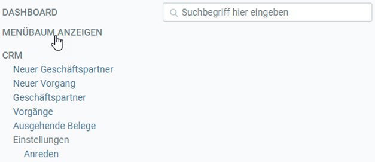

## Menü öffnen
Klicke auf  oder drücke `Alt` + `2` / `⌥ alt` + `2`, um das Menü zu öffnen.

## Menüpunkt wählen
Klicke auf den gewünschten Menüpunkt.

## Verwenden der Suchfunktion
Wenn Du nicht genau weißt, wo der gesuchte Menüpunkt ist, kannst Du auch einfach die Suchfunktion verwenden.

Gib hierzu den gewünschten Begriff (z.B. "Neuer Auftrag") in die Suchleiste ein und klicke dann auf den Link, um das Fenster zu öffnen.

## Sitemap anschauen
Wenn Du das gesamte Menü sehen möchtest, klicke auf **MENÜBAUM ANZEIGEN**.

