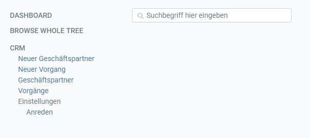

## Menü öffnen
Klicke auf  oder drücke die Tastenkombination `Strg+2` um das Menü zu öffnen und klicke auf den gewünschten Menüpunkt 

## Verwenden der Suche

Wenn Du nicht genau weißt wo die gesuchte Funktion im Menü ist, kannst Du auch einfach die Suche verwenden:

Suche im Menü nach dem gewünschten Begriff (z.B. "Neuer Auftrag") und klicke auf den Link um das Fenster zu öffnen 

## Sitemap anschauen

Wenn Du das gesamte Menü sehen möchtest, klicke auf "browse whole tree"
 
