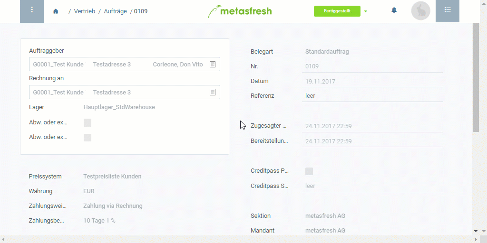

## Überblick
In metasfresh können Nachbelastungen erstellt werden, wenn sich nach Rechnungsstellung ein Guthaben zu Deinen Gunsten ergibt, z.B. durch Preisdifferenzen aufgrund von unterschiedlichen Preislistenversionen. Die Nachbelastungen werden direkt mit den dazugehörigen Rechnungen verknüpft, wodurch die Änderungen für die Buchhaltung lückenlos nachvollziehbar sind.

## Schritte

### Nachbelastung erstellen
1. [Gehe ins Menü](Menu) und öffne das Fenster "Debitoren Rechnungen".
1. [Verwende die Filterfunktion](Filterfunktion), um den Eintrag der fertiggestellten Rechnung zu finden, für die Du eine Nachbelastung erstellen möchtest und öffne ihn.
 >**Hinweis:** [Springe alternativ über die verknüpften Belege](SpringezuBelegen) eines [Auftrages](Auftrag_erfassen) in den dazugehörigen [Rechnungseintrag](Zu_Auftrag_Rechnung_erstellen).

1. [Starte die Aktion](AktionStarten#aktionsmenue) "Nachbelastung". Es öffnet sich ein Overlay-Fenster.
1. Wähle die **Belegart** *Nachbelastung - Preisdifferenz* aus.
1. Klicke auf "Start", um einen Rechnungsbeleg für die Nachbelastung zu erstellen und das Overlay-Fenster zu schließen.

### Preisdifferenz erfassen
1. [Springe über die verknüpften Belege](SpringezuBelegen) der fertiggestellten Rechnung erneut in das Fenster "Debitoren Rechnungen" (unter FAKTURIERUNG und dann "Rechnung" in der Sidebar) und öffne dort den dazugehörigen, bereits [herausgefilterten](Filterfunktion) Rechnungseintrag mit der **Belegart** *Nachbelastung - Preisdifferenz*.
1. Gehe zur Registerkarte "Rechnungsposition" unten auf der Seite und trage dort in das Feld in der Spalte **Preis** der betreffenden Zeile den Betrag der Preisdifferenz ein.
1. [Selektiere](AuswahlBelege) und lösche alle Zeilen, die nicht von der Nachbelastung betroffen sind.
1. ***Optional:*** Klicke auf , um Zeilen hinzuzufügen.
 >**Hinweis:** Drücke `Alt` + `Q` / `⌥ alt` + `Q`.

### Nachbelastung fertigstellen
1. [Stelle den Beleg fertig](BelegverarbeitungFertigstellen).
1. [Öffne die PDF-Vorschau](PDFVorschau).

## Beispiel
<kbd></kbd>
