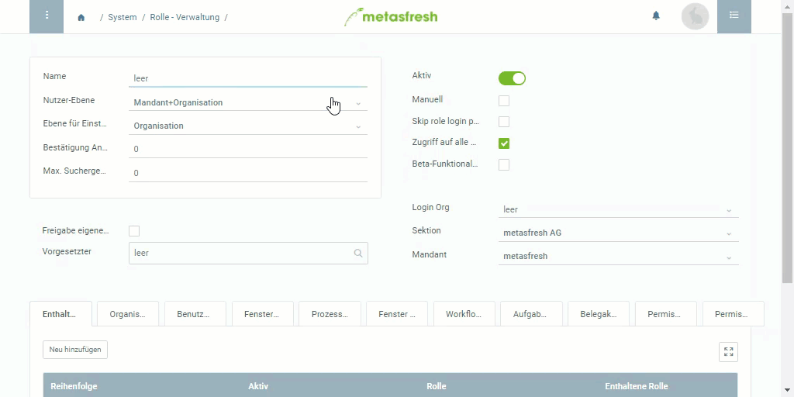

## Übersicht
Mit einer Benutzerrolle kannst Du bestimmen, auf welche Funktionen ein Nutzer Zugriff hat und welche Daten er einsehen kann.

## Schritte
1. [Gehe ins Menü](Menu) und öffne das Fenster "Rolle - Verwaltung".
1. [Lege eine neue Rolle an](Neuer_Datensatz_Fenster_Webui).
1. Benenne die Rolle im Feld **Name**, z.B. "Standard".
1. Stelle die [**Max. Suchergebnisse**](Max.Suchergebnisse_UserRole) ein.

### Die Rolle einem Systembenutzer zuweisen
1. Gehe zur Registerkarte "Benutzer-Zugriff" unten auf der Seite und klicke auf . Es öffnet sich ein Overlay-Fenster.
1. Gib im Feld **Nutzer** einen Teil des [Systembenutzer](Neuer_Systembenutzer)namens ein und klicke auf den passenden Treffer in der [Dropdown-Liste](Keyboard_Shortcuts_Liste).
1. Klicke auf "Bestätigen", um das Overlay-Fenster zu schließen und den Systembenutzer zur Liste hinzuzufügen.
1. [metasfresh speichert automatisch](Speicheranzeige).

## Beispiel

