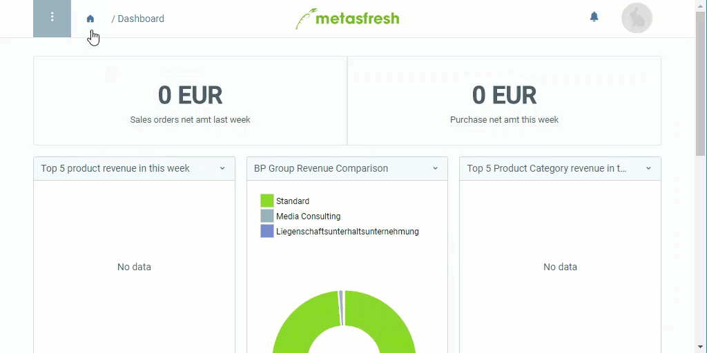

## Schritte
1. [Gehe ins Menü](Menu) und öffne das Fenster "Produkt Kategorie".
1. [Lege eine neue Produktkategorie an](Neuer_Datensatz_Fenster_Webui).
1. Benenne die Kategorie im Feld **Name**.
1. [metasfresh speichert automatisch](Speicheranzeige).

## Weitere Einstellungen (optional)
- Stelle einen [**Merkmals-Satz**](Merkmalssatz_neu_anlegen) ein.
- [Stelle eine **übergeordnete Produktkategorie** ein](Uebergeordnete_Produktkategorie).
- Wähle im Feld **Produktnummernfolge** eine [Belegnummerierung](Belegnummern_definieren) aus. Gib dazu einen Teil des Namens der Belegnummerierung ein und klicke auf den passenden Treffer in der <a href="Keyboard_Shortcuts_Liste#dropdown" title="Dynamisches Suchfeld (Autocomplete)">Dropdown-Liste</a>.

## Beispiel

