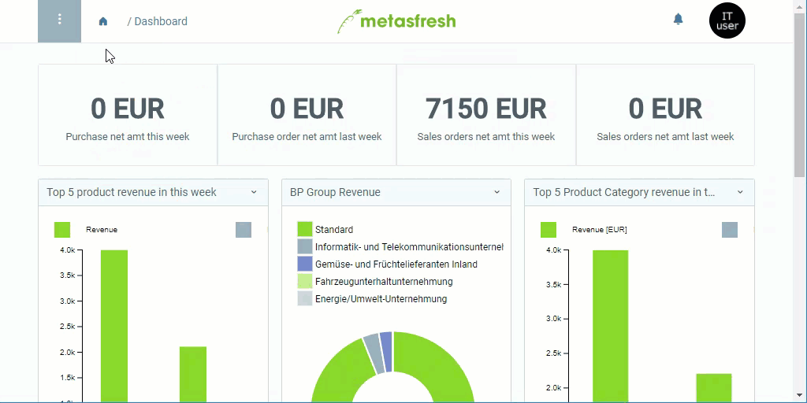

## Schritte
1. [Gehe ins Menü](Menu) und öffne den Link "Kalender und Jahr".
1. [Lege einen neuen Kalender an](Neuer_Datensatz_Fenster_Webui).
1. Benenne den Kalender im Feld **Name**.
1. [metasfresh speichert automatisch](Speicheranzeige).

## Nächste Schritte
- [Füge Kalenderperioden hinzu](Kalenderperioden_hinzufuegen).

## Beispiel

