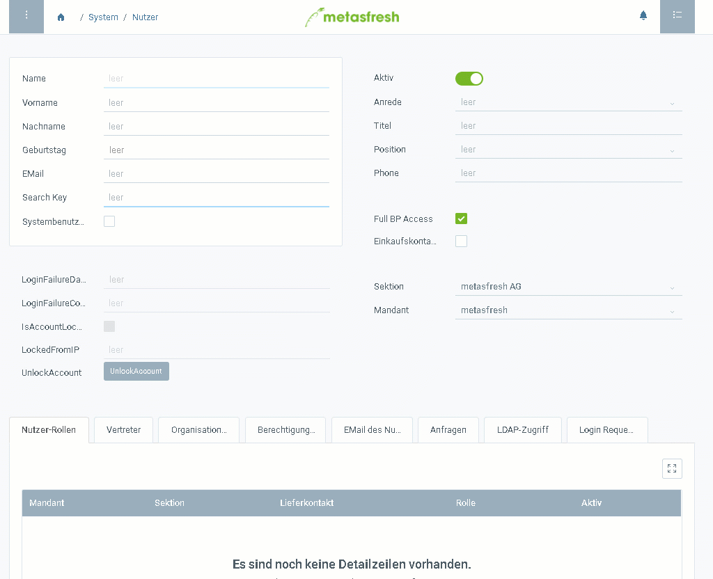

## Übersicht

Nutzer sind eigentlich Kontakte mit Anmeldeberechtigung. Deshalb findest Du die Kontakte Deiner Geschäftspartner ebenfalls im Fenster "Nutzer". 
Du kannst also neue Kontakte erstellen oder bestehenden Kontakten die Anmeldung im System ermöglichen, wenn Du diesen Schritten folgst:

## Schritte

### Erstelle einen Kontakt
1. [Melde Dich an](Anmeldung).
1. [Gehe ins Menü](Menu) und öffne den Link "Nutzer".
1. [Lege einen neuen Datensatz an](Neuer_Datensatz_Fenster_Webui).
1. Fülle die Felder **Vorname** und **Nachname** aus.
1. Vergib einen **Suchschlüssel**.

### Mache aus dem Kontakt einen Systembenutzer
1. Setze einen Haken bei **Systembenutzer**.
1. Trage bei **Login** einen Benutzernamen ein.
1. Vergib ein **Kennwort** mit mindestens 8 Zeichen.

  > Hinweis 1: Stelle sicher, dass das Passwort **mindestens 8 Zeichen** hat, sonst wird der Datensatz **nicht gespeichert**.

  > Hinweis 2: Der Benutzer kann sich wahlweise mit dem **Login** oder der **Email** anmelden.

  > Hinweis 3: Beachte beim Benutzernamen und Kennwort die **Groß- und Kleinschreibung**!

### Weise dem Nutzer eine Rolle zu
1. Gehe zur Registerkarte "Nutzer-Rollen" unten auf der Seite.
1. [Lege einen neue Rolle an](Neuer_Datensatz_Tab_Webui).
1. Wähle die Rolle aus, die der Nutzer haben soll.
1. Klicke auf "Done", um die Rolle zur Liste hinzuzufügen.

> Hinweis: Der Nutzer kann auch mehrere Rollen haben. In diesem Fall wird er bei der Anmeldung nach der gewünschten Rolle gefragt.

## Beispiel

Dieses Beispiel zeigt die Erstellung eines Nutzers "mf" mit der Rolle "WebUI":

