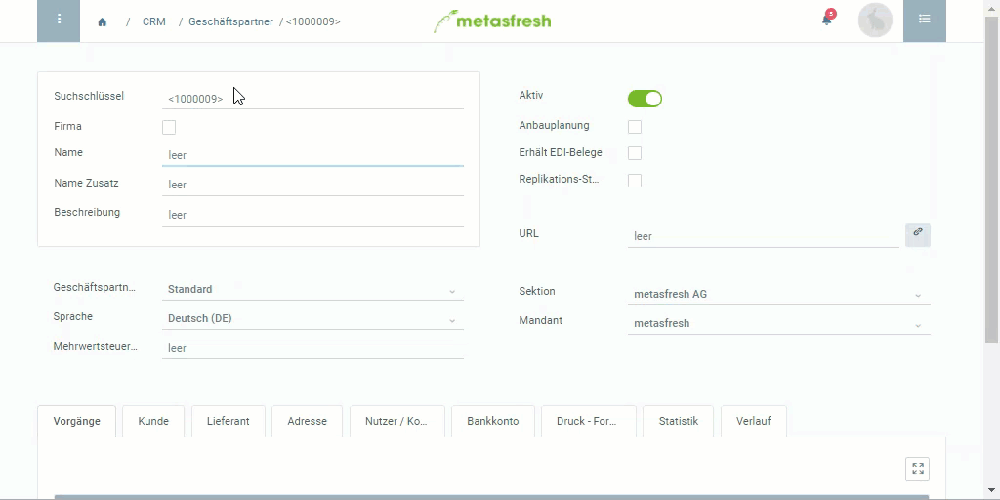

## Schritte
1. [Gehe ins Menü](Menu) und öffne das Fenster "Geschäftspartner".
1. [Lege einen neuen Geschäftspartner an](Neuer_Datensatz_Fenster_Webui).
1. Der **Suchschlüssel** ist eine automatisch zugewiesene laufende Nummer. Unter Umständen kann man stattdessen jedoch auch einen eigenen Suchschlüssel manuell vergeben.
1. Fülle das Feld **Name** aus bzw. ist bei dem Kästchen **Firma** ein Häkchen gesetzt, fülle das Feld **Firmenname** aus.
 >**Hinweis:** Der **Name/Firmenname** ist auf 60 Zeichen beschränkt.

1. Wähle eine **Geschäftspartnergruppe** aus, z.B. *Maschinenlieferant*.
1. Wähle die bevorzugte Kommunikationssprache des Partners aus.
1. [Füge eine oder mehrere Adressen hinzu](Adresse_erfassen_Tab).

## Beispiel

