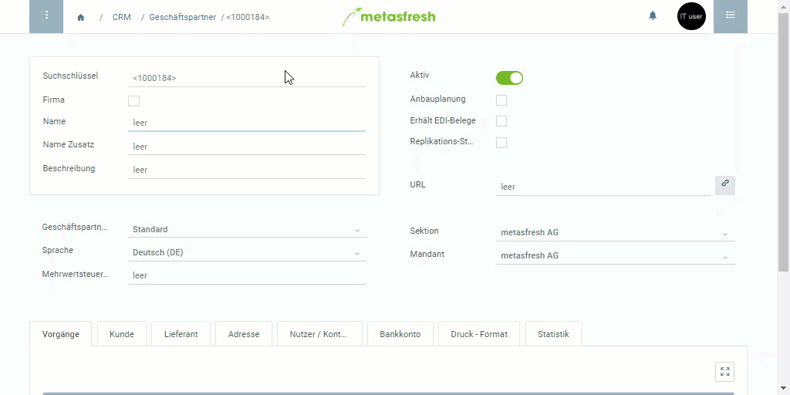

## Schritte

### Erstelle einen Geschäftspartner
1. [Gehe ins Menü](Menu) und öffne den Link "Geschäftspartner".
1. [Lege einen neuen Datensatz an](Neuer_Datensatz_Fenster_Webui).
1. Der **Suchschlüssel** ist eine automatisch zugewiesene laufende Nummer. Unter Umständen kann man stattdessen jedoch auch einen eigenen Suchschlüssel manuell vergeben.
1. Fülle das Feld **Name** aus bzw. ist bei dem Kästchen **Firma** ein Häkchen gesetzt, fülle das Feld **Firmenname** aus.
1. Wähle eine **Geschäftspartnergruppe**, z.B. “Kunde”.
1. Wähle die bevorzugte Kommunikationssprache des Partners aus.

### Adresse hinzufügen
1. Gehe zur Registerkarte "Adresse" unten auf der Seite und klicke auf "Neu hinzufügen", um das Adressfenster zu öffnen.
1. Trage im Feld **Name** den Namen des Geschäftspartners ein.
1. Klicke auf den "Edit"-Button, um eine **Anschrift** zu erfassen.
1. Trage die **Adresse**, die **PLZ**, den **Ort** und den **Staat** des Unternehmens ein.
 >Hinweis: Wenn Du "Vereinigte Staaten von Amerika" als **Staat** auswählst, kannst Du auch die **Region ID** eingeben. Klicke dazu einfach zweimal auf den Edit-Button, um das kleine Adressbearbeitungsfenster zu schließen und wieder zu öffnen. Das Feld erscheint dann über **Staat**.

1. Trage die **GLN** (Globale Lokationsnummer) des Unternehmens ein, soweit vorhanden.
1. Klicke auf "Bestätigen", um das Fenster zu schließen.
 >Hinweis: Auf diese Weise kannst Du auch mehrere Adressen erfassen, wenn nötig.

1. [metasfresh speichert automatisch](Speicheranzeige).

## Beispiel

