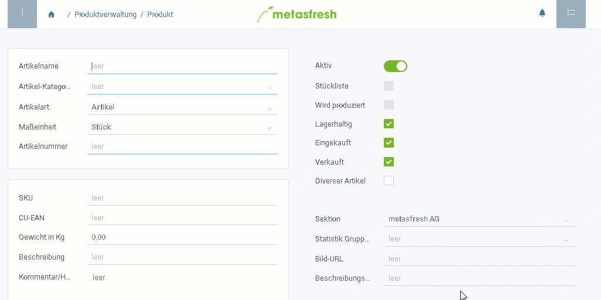

## Schritte
1. [Gehe ins Menü](Menu) und öffne das Fenster "Produkte".
1. [Lege ein neues Produkt an](Neuer_Datensatz_Fenster_Webui).
1. Benenne das Produkt im Feld **Name**.
 >**Hinweis 1:** Dieser Name erscheint auf den Belegen (z.B. Auftragsbestätigungen, Bestellbestätigungen, Rechnungen usw.).  
 >**Hinweis 2:** Der **Suchschlüssel** wird automatisch anhand der [individuell konfigurierbaren Belegnummerierung](Belegnummern_definieren) vergeben.

1. Wähle eine [**Produktkategorie**](NeueProduktkategorie) aus.
 >**Hinweis:** Die Produktkategorie wird zur Steuerung der Rabattierung, Kontierung und Merkmalsätze eines Artikels verwendet.

1. Wähle eine **Produktart** aus.
1. Wähle eine **Maßeinheit** für das Produkt aus.
 >**Hinweis:** Dies ist die Maßeinheit für die *Bestandsführung* und ***nicht zu verwechseln*** mit der Verkaufsmengeneinheit, die bei der [Preisvergabe](ProduktPreis) festgelegt wird!

1. ***Optional:*** Stelle unten rechts im Feld **Sektion** die gewünschte [Organisation](Org_Neue_Organisation_anlegen) ein. Gib dazu einen Teil des Organisationsnamens ein und klicke auf den passenden Treffer in der <a href="Keyboard_Shortcuts_Liste#dropdown" title="Dynamisches Suchfeld (Autocomplete)">Dropdown-Liste</a>.

## Nächste Schritte
- [Hinterlege Einkaufs- und Verkaufspreise für das Produkt](ProduktPreis).
- [Weise dem Produkt eine Packvorschrift zu](CU-TU_Zuordnung).
- [Konfiguriere das Produkt für die Produktion](Produktplandaten).

## Weitere Informationen
- Das Feld **Maßeinheit** bestimmt, in welcher Einheit das Produkt im Bestand geführt wird (Bestandsmengeneinheit).
 >**Hinweis 1:** Sobald der erste Beleg erstellt wurde, in dem dieses Produkt verwendet wird, kann die Bestandsmengeneinheit nicht mehr ohne Weiteres geändert werden.  
 >**Hinweis 2:** Eine abweichende Verkaufsmengeneinheit kann unter der Registerkarte "Preis" losgelöst von der Bestandsmengeneinheit definiert werden. In diesem Fall muss eine [Maßeinheitenumrechnung](Masseinheiten_umrechnen) angelegt werden.

- Das Feld **Produktart** bestimmt, um welche Art von Produkt es sich handelt.

  | Option | Bedeutung |
  | :--- | :--- |
  | Artikel | Materieller Artikel, z.B. Stückgut, Verpackung usw. (Standard) |
  | Dienstleistung | Immaterieller Artikel, z.B. Serviceleistung |
  | Erfolgskonto | Steuert Kontierung |
  | Ressource | Artikel, der zeitlich nur einmal belegt werden kann, z.B. eine Maschine, ein/e Angestellte/r usw. |

- Das Kontrollkästchen **Wird provisioniert** (bzw. *provisionsberechtigt*) zeigt an, ob das Produkt für [Provisionsverträge](Provisionsvertrag_erzeugen) zugelassen ist.
- Das Kontrollkästchen **Lagerhaltig** zeigt an, ob das Produkt (sofern die Produktart auf der Option "Artikel" steht) im Bestand geführt wird.
- Das Kontrollkästchen **Wird eingekauft** (bzw. *Beschaffungsartikel*) zeigt an, ob das Produkt im Einkauf zur Verfügung steht.
- Das Kontrollkästchen **Verkauft** (bzw. *Verkaufsartikel*) zeigt an, ob das Produkt im Verkauf zur Verfügung steht.

## Beispiel
<kbd></kbd>
