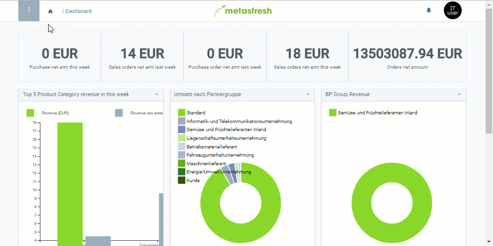

## Schritte

### Lager anlegen
1. [Gehe ins Menü](Menu) und öffne das Fenster "Lager".
1. [Lege ein neues Lager an](Neuer_Datensatz_Fenster_Webui).
1. Benenne das Lager im Feld **Name**, z.B. "[Leergebindelager](Leergebindelager_anlegen)".
1. Gib in das Feld **Standort** einen Teil des [Standort](Adresse_erfassen_Tab)namens ein und klicke auf den passenden Treffer in der <a href="Keyboard_Shortcuts_Liste#dropdown" title="Dynamisches Suchfeld (Autocomplete)">Dropdown-Liste</a>.
1. Wähle eine **Produktionsstätte** aus, sofern vorhanden.
 >**Hinweis:** Produktionsstätten werden für [Produktplanungen](Produktplandaten) und [automatische Bestellkontrollen](Automatische_Bestellkontrollen) benötigt.

1. ***Optional:*** Wähle eine [**Lagerart**](Lagerart_hinzufuegen) aus.

### <a name="lagerort">Lagerort hinzufügen</a>
1. Gehe zur Registerkarte "Lagerort" unten auf der Seite und klicke auf . Es öffnet sich ein Overlay-Fenster.
1. Trage in die Felder **Gang**, **Regal**, **Ebene** und **Fach** jeweils den Wert *0* ein.
1. Klicke auf "Bestätigen", um das Overlay-Fenster zu schließen und den Lagerort zur Liste hinzuzufügen.

### <a name="lagerzuordnung">Lagerzuordnung</a>
Hier kannst Du dem Lager diejenigen Belegarten als ***Dokument-Basistyp*** zuordnen, bei denen das Lager verwendet werden soll, z.B. *Auftrag*, *Bestellung*, *Inventur*, *Wareneingang* usw.

1. Gehe zur Registerkarte "Lagerzuordnung" unten auf der Seite und klicke auf . Es öffnet sich ein Overlay-Fenster.
1. Wähle einen **Dokument-Basistyp** aus, z.B. *Auftrag*.
1. Klicke auf "Bestätigen", um das Overlay-Fenster zu schließen und die Zuordnung zur Liste hinzuzufügen.
 >**Hinweis:** Du kannst beliebig viele Zuordnungen erstellen. Vergleiche dazu den Lagereintrag "Hauptlager", der bereits entsprechend eingerichtet ist.

## Beispiel
<kbd></kbd>
