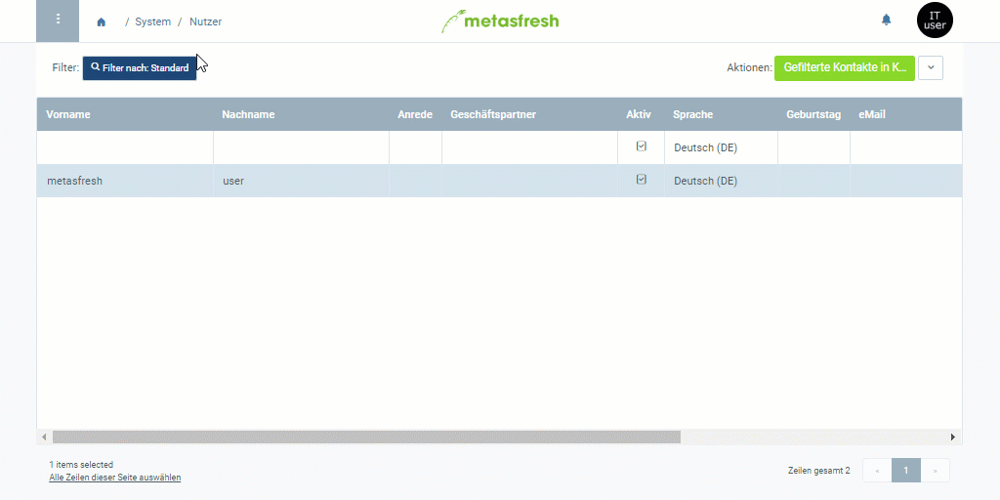

## Schritte
1. Öffne den Eintrag eines bestehenden [Nutzers](Menu) bzw. [lege einen neuen an](Nutzer_anlegen).
1. Gehe zum Feld **Geschäftspartner**, gib dort einen Teil des Namens oder der Nummer des gewünschten [Geschäftspartners](Neuer_Geschaeftspartner) ein und klicke auf den passenden Treffer in der [Dropdown-Liste](Keyboard_Shortcuts_Liste).
1. [metasfresh speichert automatisch](Speicheranzeige).
  

| **Hinweis:** |
| :--- |
| Der Nutzereintrag erscheint nun ebenfalls unter dem Menüpunkt "[Geschäftspartner](Menu)" unter der Registerkarte "Nutzer / Kontakte" unten auf der Seite des jeweiligen Geschäftspartnereintrages. |

## Beispiel

