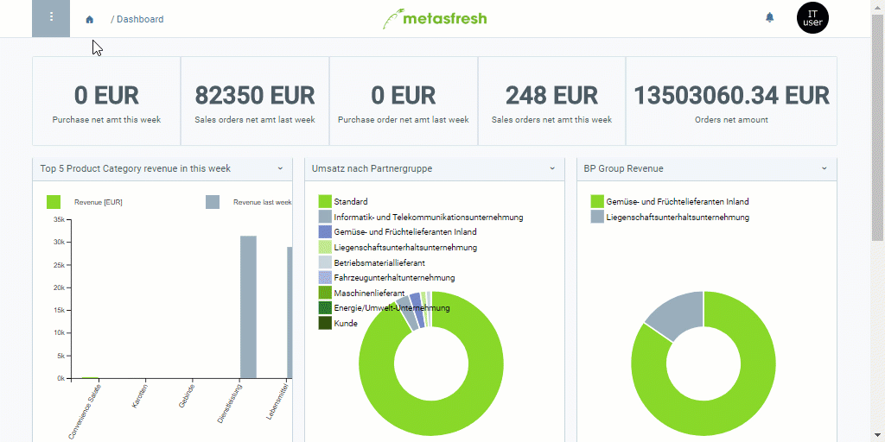

## Überblick
Nutzer sind im Allgemeinen Kontakte, die Du zusätzlich zu Deinen bestehenden Geschäftspartnern in metasfresh registrieren kannst.

Deine Geschäftspartner kannst Du ebenfalls als Nutzer registrieren, z.B. um sie als Empfänger für [Serienbriefe](Serienbriefe_erstellen) im Rahmen einer [Marketingkampagne](MKTG-Kampagne_erstellen) zu verwalten.

Um neue Nutzer anzulegen, gehe wie folgt vor:

## Schritte
1. [Melde Dich bei metasfresh an](Anmeldung).
1. [Gehe ins Menü](Menu) und öffne das Fenster "Nutzer".
1. [Lege einen neuen Nutzer an](Neuer_Datensatz_Fenster_Webui).
1. Fülle die Felder **Vorname** und **Nachname** aus.
1. Trage die **E-Mail**-Adresse des Nutzers ein.
1. Der **Suchschlüssel** ist eine automatisch zugewiesene laufende Nummer. Unter Umständen kann man stattdessen jedoch auch einen eigenen Suchschlüssel manuell vergeben.

## Nächste Schritte (optional)
- [Mache aus dem Nutzer einen Systembenutzer](Neuer_Systembenutzer) und [weise ihm eine Rolle zu](Nutzerrolle_zuweisen), um ihm die Anmeldung zu metasfresh zu ermöglichen.
- [Weise dem Nutzer einen Geschäftspartner zu](Nutzer_GPartner_zuweisen).

## Beispiel

