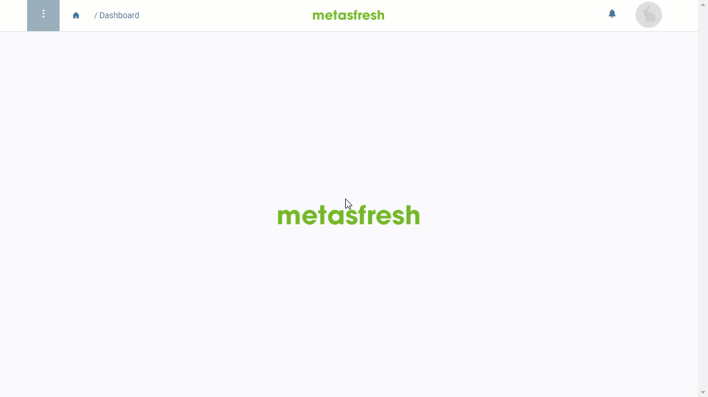

## Überblick
In metasfresh können mehrere [Nutzer](Nutzer_anlegen) zu einer Gruppe zusammengefasst werden, um ihnen bei Bedarf kollektiv bestimmte Eigenschaften zuweisen zu können, z.B. [Zugriffsberechtigungen auf einzelne Dateneinträge](Zugriffsberechtigung_Nutzer_verwalten).

## Schritte
1. [Gehe ins Menü](Menu) und öffne das Fenster "Nutzergruppe".
1. [Lege eine neue Nutzergruppe an](Neuer_Datensatz_Fenster_Webui).
1. Benenne die Nutzergruppe im Feld **Name**.
1. Gehe zur Registerkarte "Nutzergruppenzuordnung" unten auf der Seite und klicke auf . Es öffnet sich ein Overlay-Fenster.
1. Gib in das Feld **Ansprechpartner** einen Teil des Namens des Nutzers ein, der zur Gruppe hinzugefügt werden soll, und klicke auf den passenden Treffer in der <a href="Keyboard_Shortcuts_Liste#dropdown" title="Dynamisches Suchfeld (Autocomplete)">Dropdown-Liste</a>.
1. Stelle ein **Gültig ab** Datum ein.
 >**Hinweis:** Liegt das Datum in der *Vergangenheit*, gilt der Eintrag *ab sofort*. Liegt es in der *Zukunft*, gilt er *erst ab diesem Datum*.

1. Stelle ein **Gültig bis** Datum ein.
1. Klicke auf "Bestätigen", um das Overlay-Fenster zu schließen und den Nutzer zur Liste hinzuzufügen.
 >**Hinweis:** Wiederhole die Schritte 4 bis 8, um weitere Nutzer zur Liste hinzuzufügen.

1. [metasfresh speichert automatisch](Speicheranzeige).

## Beispiel
<kbd></kbd>
