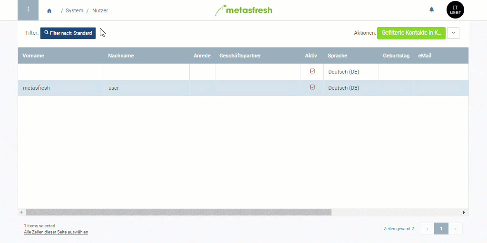

## Übersicht
Mit der Nutzerrolle kannst Du den Berechtigungsumfang eines Nutzers bestimmen.

## Schritte
1. [Gehe ins Menü](Menu) und öffne das Fenster "Nutzer".
1. Öffne den Eintrag eines bestehenden Systembenutzers bzw. [lege einen neuen an](Neuer_Systembenutzer).
1. Gehe zur Registerkarte "[Nutzer-Rollen](NeueBenutzerrolle)" unten auf der Seite und klicke auf . Es öffnet sich ein neues Fenster.
1. Wähle die Rolle aus, die dem Systembenutzer zugewiesen werden soll.
1. Klicke auf "Bestätigen", um die Rolle zur Liste hinzuzufügen.
 >**Hinweis:** Einem Systembenutzer können auch mehrere Rollen zugewiesen werden. In einem solchen Fall wird er bei der [Anmeldung](Anmeldung) nach der gewünschten Rolle gefragt.

## Nächste Schritte (optional)
- [Weise dem Nutzer einen Geschäftspartner zu](Nutzer_GPartner_zuweisen).

## Beispiel

