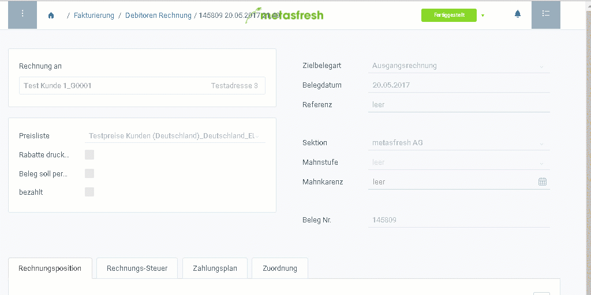

## Mit der Tastatur
Drücke `Alt` + `P` / `⌥ alt` + `P`, um die Druckvorschau zu öffnen.

## Mit der Maus
Öffne das [Aktionsmenü](AktionStarten)  und klicke auf "Drucken".
 >**Hinweis:** Du benötigst einen PDF-Viewer, damit der Beleg in der Druckvorschau angezeigt wird.

## Beispiel

