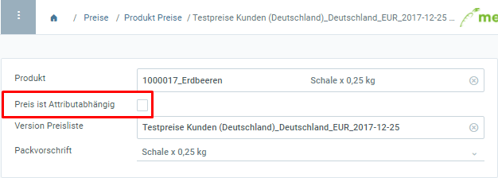
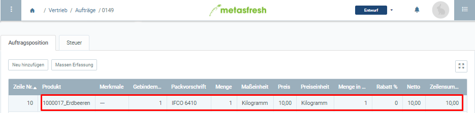
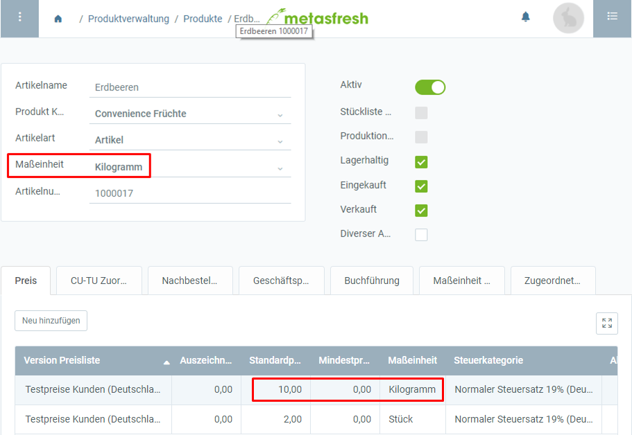
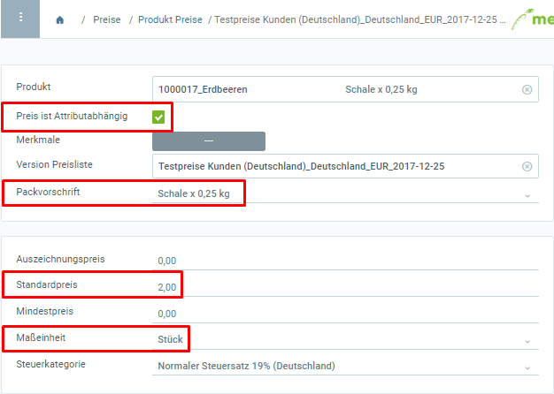
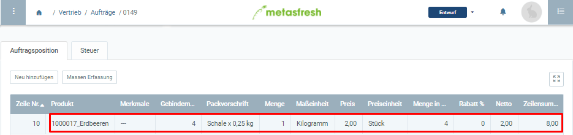

## Übersicht
Wenn Du ein Produkt verkaufst, tust Du dies nicht unbedingt immer nach der Bestandsmengeneinheit, sondern legst eine abweichende Verkaufsmengeneinheit fest, die je nachdem auch in [Gebinden](Handling_Unit_System) verpackt wird.

Unter "Produkt Preise" kannst Du daher sowohl [Packvorschriften](Packvorschrift_erstellen) auswählen als auch einstellen, ob der Preis entweder von der Bestandsmengeneinheit oder von der Verkaufsmengeneinheit abhängig ist.

## Schritte
1. [Gehe ins Menü](Menu) und öffne das Fenster "Produkt Preise".
1. Öffne den Eintrag eines bestehenden Preises bzw. [lege einen neuen an](Preis_anlegen).
1. Wähle eine **Packvorschrift** aus.
 >**Hinweis:** Packvorschriften werden erst angezeigt, wenn sie vorher dem [Produkt zugeordnet](CU-TU_Zuordnung) wurden.

1. Soll der Preis auf Grundlage der im Eintrag festgelegten Verkaufsmengeneinheit berechnet werden, dann setze ein Häkchen bei **Preis ist attributabhängig**. Ansonsten gilt die Bestandsmengeneinheit des Produktes.
 >**Hinweis:** Ist die Verkaufsmengeneinheit ≠ Bestandsmengeneinheit, muss eine [Maßeinheitenumrechnung](Masseinheiten_umrechnen) angelegt werden.

1. [metasfresh speichert automatisch](Speicheranzeige).

 
## Wie funktioniert die "Attributabhängigkeit"?

#### Fall 1: Der Preis ist *NICHT* attributabhängig.
Das Kontrollkästchen **Preis ist attributabhängig** ist nicht angehakt:

| *Folgen:* |
| :--- |
| metasfresh berechnet die Auftragszeilensumme im Auftrag auf Grundlage der Bestandsmengeneinheit des Produktes. |

 
Auftrag: 
  

Bestandsmengeneinheit: 

---

#### Fall 2: Der Preis *IST* attributabhängig.
Das Kontrollkästchen **Preis ist attributabhängig** ist angehakt:

| *Folgen:* |
| :--- |
| metasfresh berechnet die Auftragszeilensumme im Auftrag auf Grundlage der Verkaufsmengeneinheit des Produktes (siehe oben). |

 
Auftrag: 

## Beispiel

