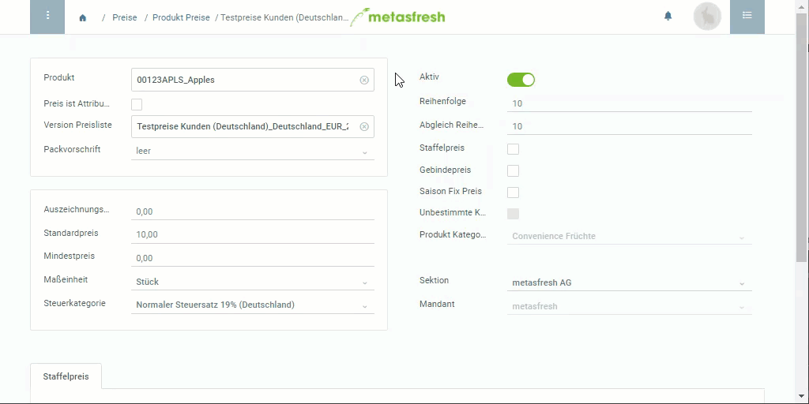

## Übersicht
Wenn Du ein Produkt in einem Gebinde verkaufen möchtest, kannst Du dies unter "Produkt Preise" einstellen.

## Schritte
1. Öffne einen bestehenden [Preis](Menu) bzw. [lege einen neuen an](Preis_anlegen).
1. Wähle eine **Packvorschrift** aus.
 >**Hinweis:** Packvorschriften werden erst angezeigt, wenn sie vorher dem [Produkt zugeordnet](CU-TU_Zuordnung) wurden.

1. Soll der Preis auf Grundlage der im Eintrag festgelegten Verkaufsmengeneinheit berechnet werden, dann setze ein Häkchen bei **Preis ist attributabhängig**. Ansonsten gilt die Bestandsmengeneinheit des Produkts.
 >**Hinweis:** Ist die Verkaufsmengeneinheit ≠ Bestandsmengeneinheit, muss eine [Maßeinheitenumrechnung](Masseinheiten_umrechnen) angelegt werden.

1. [metasfresh speichert automatisch](Speicheranzeige).

## Beispiel

