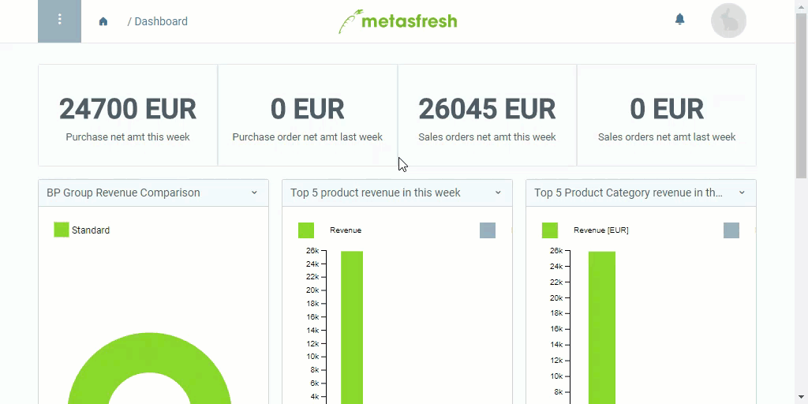

## Übersicht
Ist Dir Dein Login-Passwort entfallen oder möchtest Du es ändern, dann folge bei Deiner nächsten Anmeldung einfach der "Passwort vergessen"-Funktion und richte Dein neues Passwort ein.

## Passwort ändern (Passwort vergessen)
1. Klicke auf der Anmeldeseite unterhalb des Login-Buttons auf den Link "Forgot Password". Es öffnet sich ein neues Fenster.
1. Gib in das Eingabefeld Deine in metasfresh gespeicherte Nutzer-E-Mail-Adresse ein und klicke auf .
1. Du erhältst nun von metasfresh eine E-Mail mit den Anweisungen zur Einrichtung eines neuen Passworts.
1. Öffne die E-Mail in Deinem Postfach und klicke auf den darin enthaltenen Link. Es öffnet sich ein neuer Browser-Tab.
1. Gib Dein **Neues Passwort** mit mindestens 8 Zeichen ein.
 >**Hinweis 1:** Stelle sicher, dass das Passwort ***mindestens 8 Zeichen*** hat, sonst wird es ***nicht gespeichert***!  
 >**Hinweis 2:** Beachte beim Passwort die ***Groß- und Kleinschreibung***!

1. Wiederhole Dein **Neues Passwort (retype)**.
1. Klicke auf  und melde Dich wie gewohnt an.

## Beispiel

---

## Passwort ändern (nach Lust und Laune)
1. Öffne rechts oben in der Menüleiste das Nutzermenü .
 >**Hinweis:** Drücke `Alt` + `4` / `⌥ alt` + `4`.

1. Klicke auf "Einstellungen".
1. [Starte die Aktion](AktionStarten) "Mein Passwort ändern". Es öffnet sich ein Overlay-Fenster.
1. Gib Dein **Altes Passwort** ein.
 >**Hinweis:** Halte  gedrückt, um das Passwort anzuzeigen.

1. Gib Dein **Neues Passwort** mit mindestens 8 Zeichen ein.
 >**Hinweis 1:** Stelle sicher, dass das Passwort ***mindestens 8 Zeichen*** hat, sonst wird es ***nicht gespeichert***!  
 >**Hinweis 2:** Beachte beim Passwort die ***Groß- und Kleinschreibung***!

1. Wiederhole Dein **Neues Passwort (retype)**.
1. Klicke auf "Start", um die Änderungen zu übernehmen und das Overlay-Fenster zu schließen.

## Beispiel

