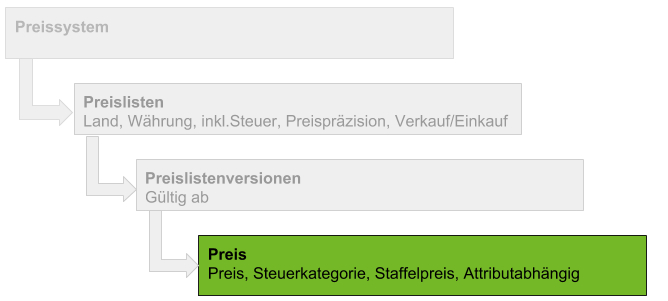

## Übersicht

## Schritte
1. [Gehe ins Menü](Menu) und öffne den Link "Produkt Preise".
1. [Lege einen neuen Preis an](Neuer_Datensatz_Fenster_Webui).
1. Gib das **[Produkt](NeuesProdukt)** ein, für das der Preis gelten soll, und wähle das entsprechende Produkt aus den Vorschlägen aus.
1. Gib unter **Version Preisliste** den Namen der vorgesehenen [Preislistenversion](Preislistenversion_anlegen) ein.
 >**Hinweis:** Drücke die `LEERTASTE`, um alle verfügbaren Preislistenversionen zu sehen.

1. Das Feld **Auszeichnungspreis** bestimmt den Listenpreis, welcher später auf den Belegen aufgeführt wird.
1. Das Feld **Standardpreis** bestimmt den tatsächlich geltenden Einkaufs- bzw. Verkaufspreis (je nachdem, ob es sich um eine Einkaufs- oder Verkaufspreisliste handelt).
1. Der **Mindestpreis** darf von einer manuellen Preisänderung durch den Benutzer, z.B. in der Auftragszeile, nicht unterschritten werden!
1. Das Feld **Maßeinheit** bestimmt die Preiseinheit, für die der Preis gilt und ist nicht zu verwechseln mit der Maßeinheit des Artikels für die Bestandsführung!
1. Im Feld **Steuerkategorie** kannst Du die jeweilige Mehrwertsteuerkategorie wählen, wie z.B. *normal*, *reduziert*, *steuerfrei*.
1. [metasfresh speichert automatisch](Speicheranzeige).

## Nächste Schritte
[Ordne die Preise einem Partner zu](Zuordnung_Preise_Partner).

## Beispiel

