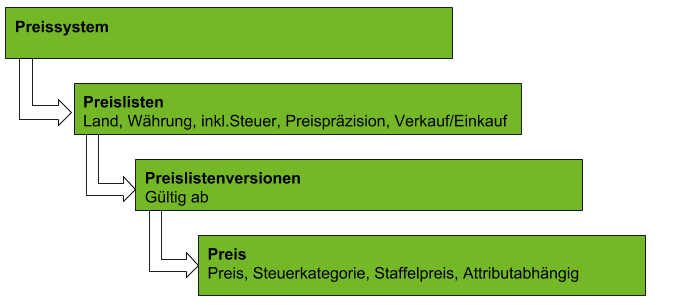

## Übersicht

## Schritte
1. [Lege ein Preissystem an](Preissystem_anlegen).
1. [Lege eine Preisliste an](Preisliste_anlegen).
1. [Lege eine Preislistenversion an](Preislistenversion_anlegen).
1. [Lege einen Preis an](Preis_anlegen).
1. [Weise die Preise einem Partner zu](Zuweisung_Preise_Partner).
