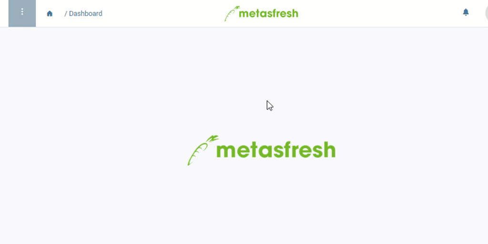

## Übersicht
In metasfresh kannst Du zeitlich begrenzte Sonderpreisaktionen starten, bei denen ein bestimmtes Produkt zu einem speziell festgelegten Aktionspreis gehandelt wird. Dieser Preis gilt dann entweder für einzelne Geschäftspartner (sowohl Kunden als auch Lieferanten) oder für ganze Geschäftspartnergruppen. Alle bisher definierten Preiskonditionen werden folglich während des Aktionszeitraumes überschrieben und treten erst nach Ablauf der Sonderpreisaktion wieder in Kraft.

## Schritte
1. [Gehe ins Menü](Menu) und öffne das Fenster "Aktionspreise".
1. [Lege einen neuen Eintrag an](Neuer_Datensatz_Fenster_Webui).
1. Wähle das [**Produkt**](NeuesProdukt) aus, für welches Du ein Sonderangebot machen möchtest. Gib hierzu einen Teil des Produktnamens oder der Produktnummer in das Feld ein und klicke auf eines der Ergebnisse aus der [Dropdown-Liste](Keyboard_Shortcuts_Liste).
1. **a)** Wähle einen [**Geschäftspartner**](Neuer_Geschaeftspartner) aus, für den das Sonderangebot gelten soll. Gib hierzu einen Teil des Partnernamens oder der Partnernummer in das Feld ein und klicke auf eines der Ergebnisse aus der [Dropdown-Liste](Keyboard_Shortcuts_Liste).  
**b)** Wähle eine [**Geschäftspartnergruppe**](Neue_Geschaeftspartnergruppe) aus, für die das Sonderangebot gelten soll. Gib hierzu einen Teil der Bezeichnung der Partnergruppe in das Feld ein und klicke auf eines der Ergebnisse aus der [Dropdown-Liste](Keyboard_Shortcuts_Liste).
 >**Hinweis:** Je nach Geschäftsbeziehung des Partners ([Kunde](Neuer_Geschaeftspartner_Kunde) oder [Lieferant](Neuer_Geschaeftspartner_Lieferant)) kommt der Aktionspreis entweder in [Auftrag](Auftrag_erfassen) oder [Bestellung](Bestellung_erfassen) zum Tragen.

1. Wähle ein **Land** aus, in dem das Sonderangebot gelten soll. Gib hierzu einen Teil des Ländernamens in das Feld ein und klicke auf eines der Ergebnisse aus der [Dropdown-Liste](Keyboard_Shortcuts_Liste).
 >**Hinweis:** Die **Währung** wird entsprechend dem ausgewählten Land automatisch aktualisiert, kann jedoch nachträglich manuell geändert werden.

1. Stelle ein **Gültig ab** Datum ein.
 >**Hinweis:** Liegt das Datum in der *Vergangenheit*, gilt der Aktionspreis *ab sofort*. Liegt es in der *Zukunft*, gilt er *erst ab diesem Datum*. metasfresh orientiert sich am zugesagten Termin in Auftrag oder Bestellung und verwendet dementsprechend den jeweils gültigen Preis.

1. Stelle ein **Gültig bis** Datum ein.
1. Trage einen **Standardpreis** ein, der in dem festgelegten Zeitraum als Aktionspreis für das ausgewählte Produkt verwendet werden soll.
1. Wähle eine **Steuerkategorie** aus.
1. [metasfresh speichert automatisch](Speicheranzeige).

## Beispiel

