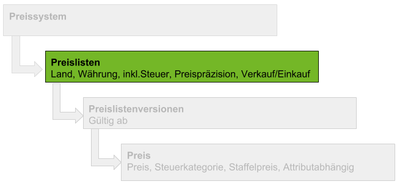
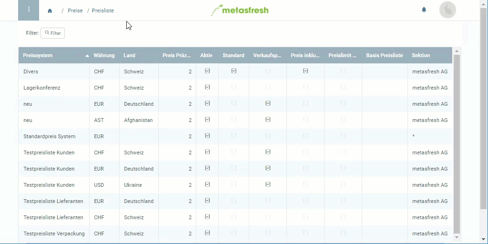

## Übersicht

Preislisten können länder- und währungsspezifisch sein und somit einem bestimmten Partner (Kunden/Lieferanten) oder einer bestimmten Partnergruppe zugewiesen werden.

## Schritte
1. [Gehe ins Menü](Menu) und öffne den Link "Preisliste".
1. [Lege eine neue Preisliste an](Neuer_Datensatz_Fenster_Webui).
1. Benenne die Preisliste im Feld **Name**.
1. Wähle das **Land** aus, für das die Preisliste gelten soll.
 >**Hinweis:** Das Land der Preisliste **muss** mit dem Land der Liefer- und Rechnungsadresse des Partners **übereinstimmen**.

1. Wähle eine **Währung** aus.
1. Das Feld **Preispräzision** bestimmt, wie viele Nachkommastellen bei der Preisberechnung berücksichtigt werden.
1. Wähle das **[Preissystem](Preissystem_anlegen)** aus, mit dem die Preisliste verknüpft werden soll.
1. Das Kästchen **Verkaufspreisliste** bestimmt, ob diese Preisliste für den *Verkauf* verwendet werden soll und somit z.B. im [Verkaufsauftrag](Auftrag_erfassen) auswählbar ist. Wird das Häkchen entfernt, ist es automatisch eine ***Einkaufspreisliste***.
1. Das Kästchen **Preis inkl. Steuern** bestimmt, ob die Preise *brutto* oder *netto* (d.h. inklusive oder exklusive Mehrwertsteuer) zu verstehen sind. metasfresh berechnet die Preise dementsprechend.
1. [metasfresh speichert automatisch](Speicheranzeige).

## Nächste Schritte
[Lege eine Preislistenversion an](Preislistenversion_anlegen).

## Beispiel

