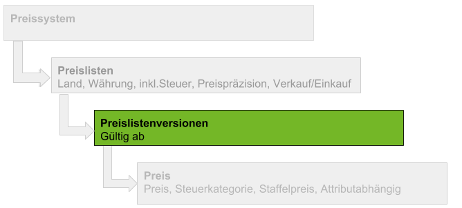

## Übersicht

## Schritte
1. Öffne den Eintrag einer bestehenden [Preisliste](Menu) bzw. [lege eine neue an](Preisliste_anlegen).
1. Gehe zur Registerkarte "Preislistenversion" unten auf der Seite und klicke auf . Es öffnet sich ein Overlay-Fenster.
1. Benenne die Preislistenversion im Feld **Name** oder übernimm stattdessen das vorgegebene Erstellungsdatum.
1. Stelle ein **Gültig ab** Datum für diese Version ein.
 >**Hinweis:** Liegt das Datum in der *Vergangenheit*, gilt die Version *ab sofort*. Liegt es in der *Zukunft*, werden die Preise *erst ab diesem Datum* verwendet. metasfresh orientiert sich am zugesagten Termin in Auftrag oder Bestellung und übernimmt dementsprechend die Preise von der jeweils gültigen Preislistenversion.

1. Klicke auf "Bestätigen", um das Overlay-Fenster zu schließen und die Preislistenversion zur Liste hinzuzufügen.
 >**Hinweis:** Wiederhole die Schritte 2 bis 5, um weitere Preislistenversionen zu erstellen.

## Nächste Schritte
- [Lege einen Preis an](Preis_anlegen).

## Beispiel

