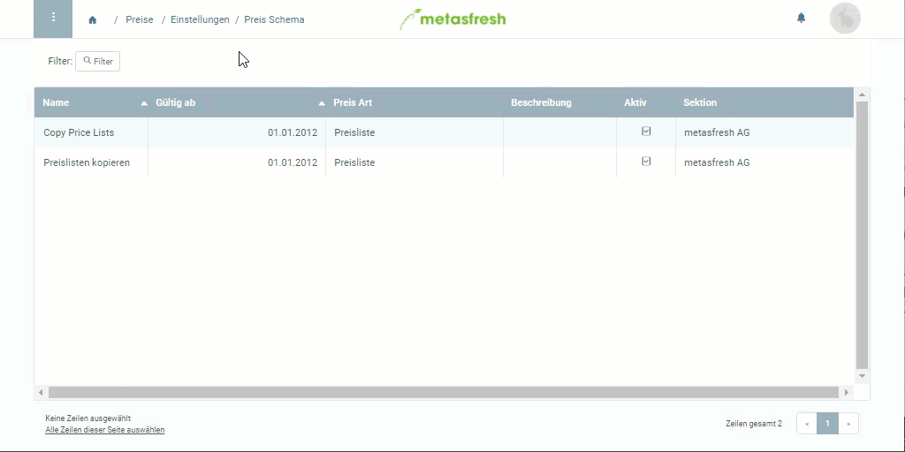

## Übersicht
Du kannst in einem Preisschema Regeln festlegen, die beim Kopieren von Preislisten berücksichtigt werden sollen, wie z.B. Preisaufschläge o.ä.

## Schritte
1. [Gehe ins Menü](Menu) und öffne den Link "Preis Schema".
1. Öffne das Preisschema mit dem Namen "Preislisten kopieren".
1. Gehe zur Registerkarte "Schema Position" unten auf der Seite und klicke auf . Es öffnet sich ein neues Fenster.
1. Trage einen **Aufschlag auf Standardpreis** ein.
1. Klicke auf "Bestätigen", um das Fenster zu schließen und die Regel zur Liste hinzuzufügen.

Wird dieses Preisschema nun beim Kopieren von Preislisten verwendet, erhalten alle betroffenen Produkte den festgelegten Aufschlag auf ihren Standardpreis.

## Beispiel

