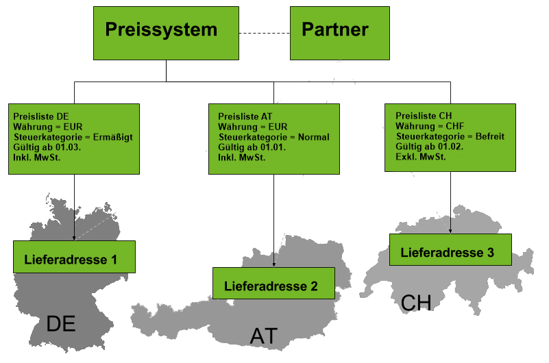

## Überblick
Ein [Preissystem](Preissystem_anlegen) umfasst mehrere verschiedene [Preislisten](Preisliste_anlegen). Diese Preislisten können länder- und währungsspezifisch sein, damit man sie einem bestimmten [Partner](Neuer_Geschaeftspartner) ([Kunden](Neuer_Geschaeftspartner_Kunde)/[Lieferanten](Neuer_Geschaeftspartner_Lieferant)) oder einer bestimmten [Partnergruppe](Neue_Geschaeftspartnergruppe) [zuweisen](Zuweisung_Preise_Partner) kann.

