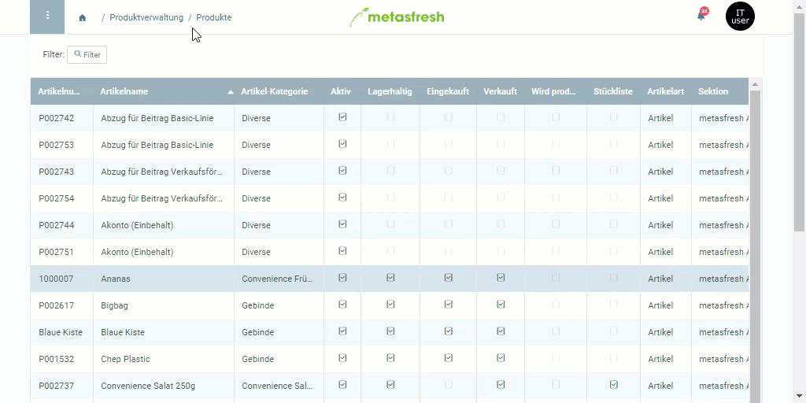

## Schritte
1. Öffne den Eintrag eines bestehenden [Produktes](Menu) bzw. [lege ein neues an](NeuesProdukt).
1. Gehe zur Registerkarte "Geschäftspartner" unten auf der Seite und klicke auf . Es öffnet sich ein neues Fenster.
1. Gib den Namen des **Geschäftspartners** ein.
 >**Hinweis 1:** Geschäftspartner können Kunden und Lieferanten sein.  
 >**Hinweis 2:** Drücke die `LEERTASTE`, um alle verfügbaren [Geschäftspartner](Neuer_Geschaeftspartner) zu sehen.  
 >**Hinweis 3:** Auswahl des Treffers mit Maus oder .

1. Klicke auf "Bestätigen", um das Fenster zu schließen und den Geschäftspartner zur Liste hinzuzufügen.
 >**Hinweis:** Wiederhole die Schritte 2 bis 4, um weitere Geschäftspartner hinzuzufügen.

## Beispiel

