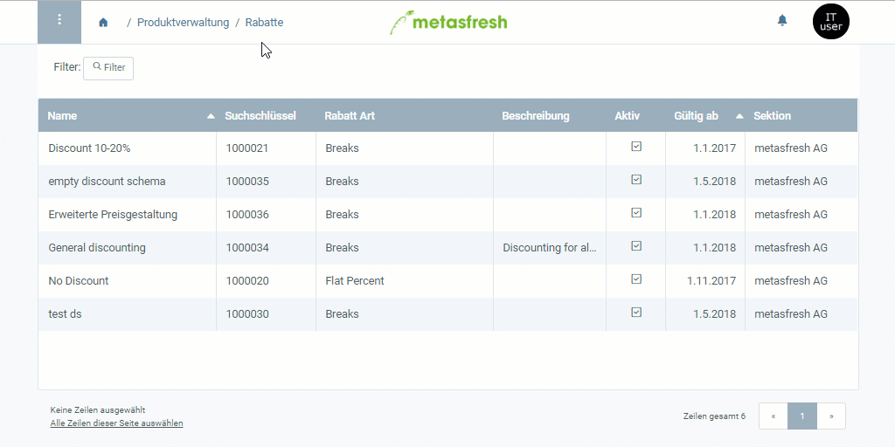

## Übersicht
In metasfresh kannst Du eine Preisliste für mehrere Geschäftspartner verwenden. Doch was ist, wenn Du individuelle Preise für bestimmte Partner festlegen möchtest? Sicherlich möchtest Du keine neue Preisliste für jeden einzelnen erstellen und am Ende duplizierte Daten und zusätzlichen Organisationsaufwand haben.

In diesem Fall kannst Du ganz einfach Preiskonditionen über das Rabattschema erstellen und diese mit dem betreffenden Geschäftspartner verknüpfen. 
Hierzu stehen Dir zwei Möglichkeiten zur Auswahl:

- **Festpreis:** Du kannst einen neuen Standardpreis als Festpreis festlegen.
- **Aufschlag auf Standardpreis:** Du kannst einen Aufschlag auf den in einem Preissystem vorhandenen Standardpreis festlegen.

## Schritte
1. Folge dieser [Anleitung zum Anlegen eines Rabattschemas](Rabattschema_anlegen) bis zum **Schritt 9**.

### a) Festpreis festlegen
1. Wähle im Feld **Preisgrundlage** *Festpreis* aus.
1. Trage einen **Festpreis** ein, der bei Erfüllung der Preiskonditionen für das/die Produkt/e verwendet werden soll.

### b) Aufschlag auf einen Standardpreis festlegen
1. Wähle im Feld **Preisgrundlage** *Preissystem* aus. Es erscheint ein neues Feld **Preissystem**.
1. Gib im Feld **Preissystem** einen Teil des gewünschten Basis-[Preissystems](Preissystem_anlegen) ein und klicke auf den passenden Treffer in der [Dropdown-Liste](Liste_Keyboard_Shortcuts).
1. Trage einen **Aufschlag auf Standardpreis** ein, der bei Erfüllung der Preiskonditionen auf den im Basispreissystem festgelegten Standardpreis draufgerechnet werden soll.

### Nächste Schritte
1. Klicke auf "Bestätigen", um das Overlay-Fenster zu schließen und die Preiskondition zur Liste hinzuzufügen.
1. [Verknüpfe das Rabattschema mit einem Geschäftspartner](Rabattschema_mit_GP_verknuepfen).

## Beispiel

